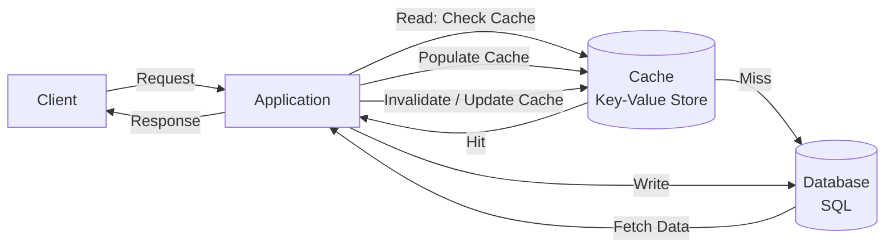
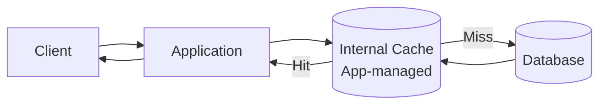
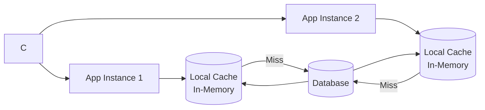
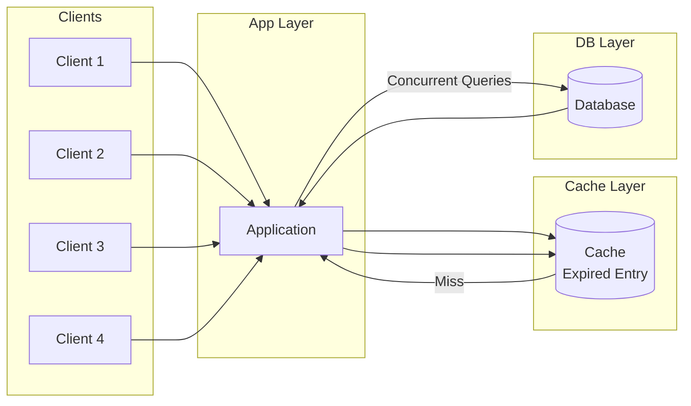
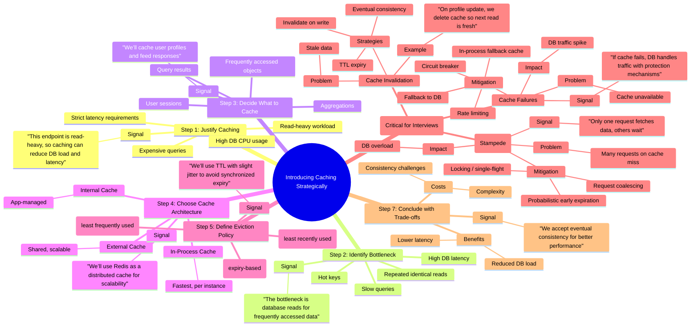

# Caching

## Cache types

### External caching

- external cache is a standalone cache service that your application talks to over the network.
- stores in *Redis or memcached* 
- support eviction policies like LRU and expiration via TTL so your memory footprint is small.

#### CDN: Content Delivery Network

- A CDN is a geographically distributed network of servers that caches content close to users. 
- Instead of every request traveling to your origin server, a CDN stores copies of your content at edge servers around the world.
  
### client side caching

- Client-side caching stores data close to the requester to avoid unnecessary network calls. 
- means the user's device, like a browser (HTTP cache, localStorage) or mobile app using local memory or on-device storage.
- Example: Strava App for running updating the data while offline, Redis client of metadata of the cluster node to connect directly

### In-Process caching

- Cache lives inside each app instance memory
- No sharing between instances

## Cache Architecture

### Lazy-Aside Caching (Lazy Loading)

Explained under this link: [Cache-aside (Lazy Loading)](concepts/core-concepts.md#cache-aside-lazy-loading)

### Write-Through Caching

Explained under this link: [Write-Through Caching](concepts/core-concepts.md#write-through-caching)

### Write-Behind Caching

Explained under this link: [Write-Behind Caching](concepts/core-concepts.md#write-behind-caching)

### Read-Through Caching

Explained under this link: [Read-Through Caching](concepts/core-concepts.md#read-through-caching)

## Cache Eviction Policies

### LRU (Least Recently Used)

- It is the default in many systems because it adapts well to most workloads where recently used data is likely to be used again

### LFU (Least Frequently Used)

- This works well when certain keys are consistently popular over time, like trending videos or top playlists.
- Some implementations use approximate LFU to avoid the cost of precise frequency tracking.

### FIFO (First In First Out)

- Because it may evict items that are still hot, it is rarely used in real systems beyond simple caching layers.
  
### TTL (Time To Live)

- TTL is not an eviction policy by itself.
- combined with LRU or LFU to balance freshness and memory usage.

## Caching Problems

### Cache Stampede

- There is a brief window, even if only a second, where every request misses the cache and goes straight to the database. 
- Instead of one query, you suddenly have hundreds or thousands, which can overload the database.

### How to handle

#### Cache stampede

- Request coalescing (single flight): reduce the number of concurrent requests to the database.
- Cache warming: pre-populate the cache with data from the database before the TTL expires.

#### Cache Consistency

- *Cache invalidation on writes*: Delete the cache entry after updating the database so it gets repopulated with fresh data.
- *Short TTLs for stale tolerance*: Let slightly stale data live temporarily if eventual consistency is acceptable.
- *Accept eventual consistency*: For feeds, metrics, and analytics, a short delay is usually fine.

#### Hot Keys

- A hot key is a cache entry that receives a huge amount of traffic compared to everything else.

How to Handle Hot Keys:

- Replicate hot keys: Store the same value on multiple cache nodes and load balance reads across them.
- Add a local fallback cache: Keep extremely hot values in-process to avoid pounding Redis.
- Apply rate limiting: Slow down abusive traffic patterns on specific keys.

## Summary

