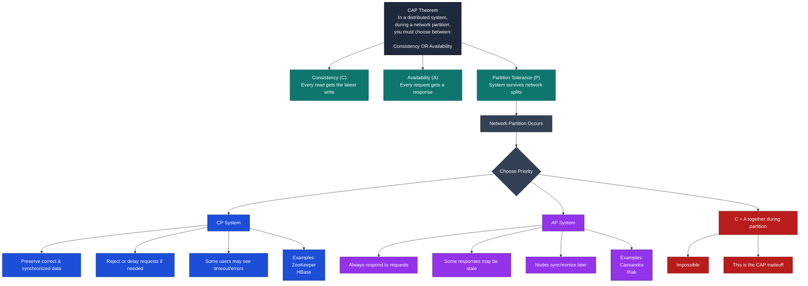
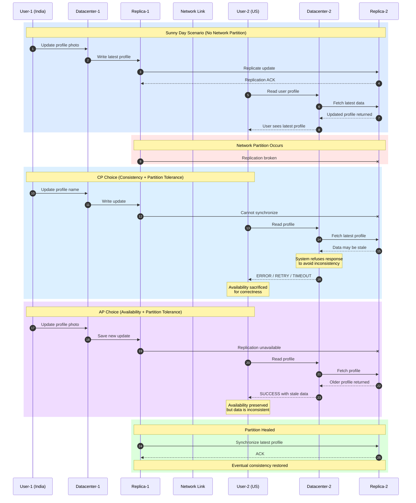
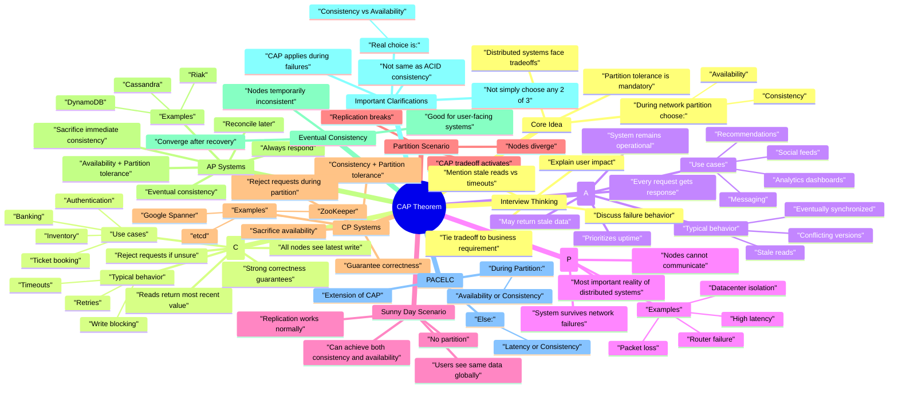

# Consistency Availability Partition-Tolerance

## Explanantions

- Consistency: All nodes see the same data at the same time. When a write is made to one node, all subsequent reads from any node will return that updated value.
  - Consistency: Every read gets the latest write.
- Availability: Every request to a non-failing node receives a response, without the guarantee that it contains the most recent version of the data.
  - Availability: Every request gets a response.
- Partition Tolerance: The system continues to operate despite arbitrary message loss or failure of part of the system (i.e., network partitions between nodes).
  - Partition Tolerance: System survives network splits.
- *In a distributed system, during a network partition, you must choose between Consistency OR Availability.*

### Example

### Choosing Availability Versus Consistency

- If Consistency more important than availability
  - Some systems absolutely require consistency, even at the cost of availability:
    - Ticket Booking Systems: Imagine if User A booked seat 6A on a flight, but due to a network partition, User B sees the seat as available and books it too. You'd have two people showing up for the same seat!
    - E-commerce Inventory: If Amazon has one toothbrush left and the system shows it as available to multiple users during a network partition, they could oversell their inventory.
    - Financial Systems: Stock trading platforms need to show accurate, up-to-date order books. Showing stale data could lead to trades at incorrect prices.

  - Distributed Transactions: Ensuring multiple data stores (like cache and database) remain in sync through two-phase commit protocols. This adds complexity but guarantees consistency across all nodes. This means users will likely experience higher latency as the system ensures data is consistent across all nodes.
  - Single-Node Solutions: Using a single database instance to avoid propagation issues entirely. While this limits scalability, it eliminates consistency challenges by having a single source of truth.

  - Technology choices
    - Postgresql, Google Spanner, DynamoDB

- If Availability is more important than consistency
  - Systems which need availability
    - Social Media: If User A updates their profile picture, it's perfectly fine if User B sees the old picture for a few minutes.
    - Content Platforms (like Netflix): If someone updates a movie description, showing the old description temporarily to some users isn't catastrophic.
    - Review Sites (like Yelp): If a restaurant updates their hours, showing slightly outdated information briefly is better than showing no information at all.
  - Multiple Replicas: Scaling to additional read replicas with asynchronous replication, allowing reads to be served from any replica even if it's slightly behind. This improves read performance and availability at the cost of potential staleness.
  - Change Data Capture (CDC): Using CDC to track changes in the primary database and propagate them asynchronously to replicas, caches, and other systems. This allows the primary system to remain available while updates flow through the system eventually.

  - Technology choices:
    - Cassandra, Amazon DynamoDB, Redis

*Note:* In a product it can be like some feature follow availability other feature follow consistency.
        For Example: Ticket Master: Showing seat available will be with availability but tickt booking will be with consistency.

### Consistency Levels

- Strong Consistency
  All reads reflect the most recent write. This is the most expensive consistency model in terms of performance, but is necessary for systems that require absolute accuracy like bank account balances. This is what we have been discussing so far.
- Causal Consistency
  Related events appear in the same order to all users. This ensures logical ordering of dependent actions, such as ensuring comments on a post must appear after the post itself.
- Read Your Write Consistency
  Users always see their own updates immediately, though other users might see older versions. This is commonly used in social media platforms where users expect to see their own profile updates right away.
- Eventual Consistency
  The system will become consistent over time but may temporarily have inconsistencies. This is the most relaxed form of consistency and is often used in systems like DNS where temporary inconsistencies are acceptable. This is the default behavior of most distributed databases and what we are implicitly choosing when we prioritize availability.

## Summary

