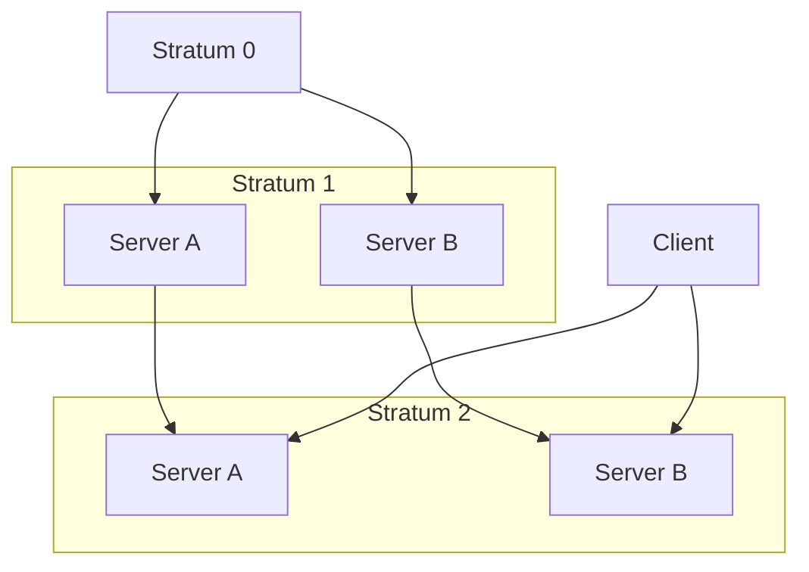
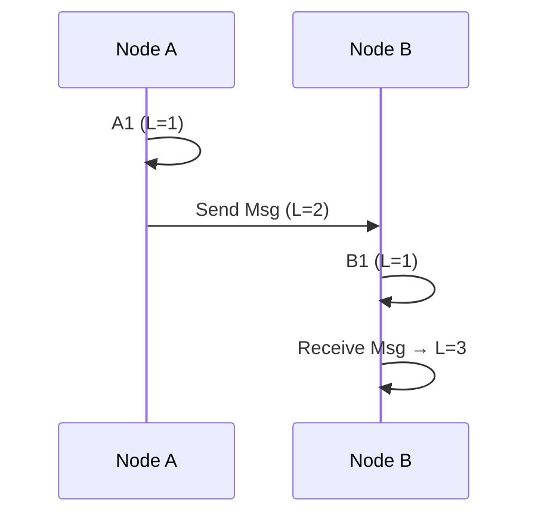
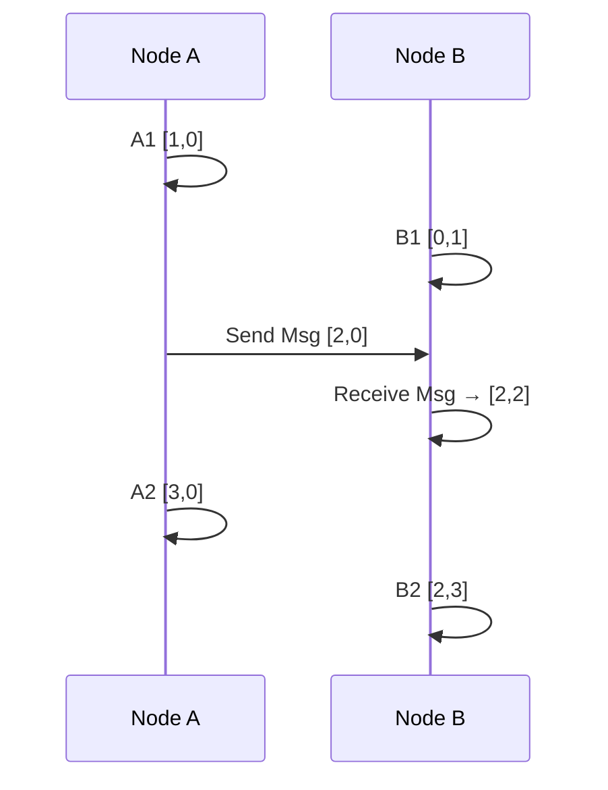
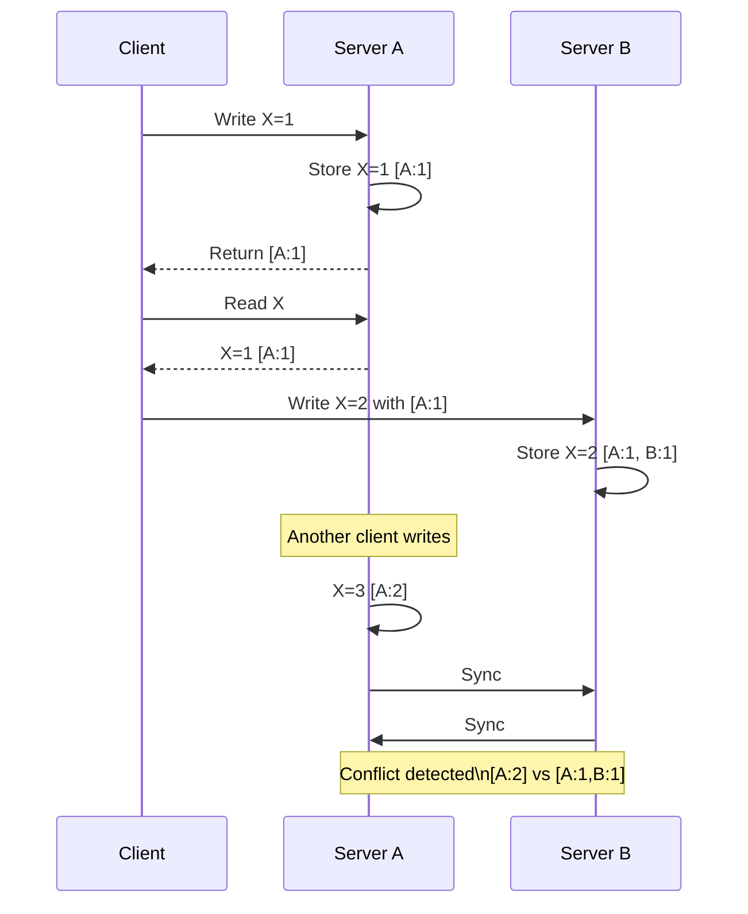

# Clocks

## Clocks

``` text
Clocks
 ├── Physical Clocks
 │    ├── Wall Clock (UTC)
 │    ├── Real Time Clock
 |    └── Quartz Clock
 |    └── Atomic Clocks
 |    └── GPS Clocks
 │
 └── Logical Clocks
      ├── Lamport Clock
      ├── Vector Clock
      ├── Version Vectors
      └── Hybrid Logical Clock
```

### Realtime Clocks

- Works with quartz, with 1HZ using battery
- Can be used for synchronization by OS

### Quartz Clock

- Use quartz with mechanism with timing signal
- Quartz oscilator clocks at 32kHz, this provides ticks to mesaure time intervals
- Uses peizo electric effect

### Atomic Clocks

- By using ceasium, they count in nanoseconds (10^9).
- Count of radiation is used.
- Datacenter runs on this clock

### GPS Clocks

- Use GPS signal to measure time intervals
- Internally uses atomic clock

## Standard of Time

- International Atomic time (TA1) based on Atomic clock)
- UT1 (Universal Time/ Astronomical Time)
- UTC (Universal Coordinated Time) iSTandard time used across globe:
  - (Based on Epoch number and Atomic clock)

### Adjustment

- UTC = UT1 + TAI
- Time slew, Time drift, Stepping, Leap seconds are all kind of time related addition or deletion from the reference time.

### NTP (Network Time Protocol)

- Uses UDP port 123

### How client sync time



```text
Stratum 0 | Source of truth
    Atomic clocks, GPS clocks (not directly connected to network)
Stratum 1 | Direct Distributer
    Directly connected to Stratum 0
    Highly accurate time servers
Stratum 2 | Scaled Distributer
    Sync from Stratum 1
    Used by most clients
Client -> Smart consumer

- Load distribution and scalability in mind for above diagram
```

### Time Synchronization Protocol

- NTP (Network Time Protocol)
  - Works over standard IP networks (Internet/LAN)
  - Uses multiple time servers + statistical averaging
  - Purely software-based
  Typical accuracy:
    - ~1–10 ms (internet)
    - ~sub-ms (good LAN)
  - Client sends request → server responds with timestamps
  - Client estimates:
    - Network delay
    - Clock offset
    - Adjusts clock gradually
  Example: Web servers, 2G networks

- PTP (Precision Time Protocol)
  - Designed for high precision environments
  - Uses hardware timestamping (NIC / switches)
  - best in controlled LANs
    Typical accuracy:
    - Microseconds (µs)
    - Even nanoseconds (ns) with hardware support- NIST (National Institute of Standards and Technology)

  - Master clock sends sync messages
  - Slaves measure exact transmission time using hardware
  - Compensates for:
  - Network delay
  - Path asymmetry
  Example: FInancial platforms, 5G networks

### Monotonic Clock

- Monotonic clock = time that always increases
  - Wall clock: 10:00 → 09:59 (can go backward ❌)
  - Monotonic: 100 → 105 → 110 (always forward ✅)

#### Smearing Leap

- Leap smearing = spread the extra second slowly instead of adding it suddenly
  - Leap second = “add 1 second instantly”
  - Smearing    = “stretch time slightly to absorb that second”

## Logical Clocks

### Lamport clock

- Lamport clock = timestamp + sequence number
- Timestamp =   number of seconds since epoch
- Just a single counter
- Gives order, not concurrency



### Vector Clock

- Each node keeps a vector
- Can detect independent events or concurrent events



### Version Vector

- Version vector = vector clock + sequence number
- Sequence number = timestamp + sequence number
- Change happens according to who is the actor
- Key value pair of actor and sequence number



```text
Client = messenger of history  
Server = decision maker  
Version vector = proof of causality
```

## Ordering of events

```text
FIFO → Causal → Total (Global) → Strict / Linearizable
```

### FIFO (First In First Out)

- FIFO = First In First Out
  - If not aligned TCP does the realignment for us

Sender A: M1 → M2 → M3  
Receiver sees: M1 → M2 → M3 ✅

Note: *Order preserved only per sender*

### Causal Ordering

A: write X=1  
B: reads X=1 → writes X=2  

Seen asi: write X=1 → write X=2 ✅

Using:

- Vector clocks
- Version vectors

### Total Ordering

A: M1  
B: M2  

All nodes see:
M1 → M2  OR  M2 → M1 (but same everywhere)

Using:

- Central sequencer
- Consensus (Raft, Paxos)

Note: *Same order across all replicas*

### Strict Ordering

*Order matches real time*

If A happens before B in real time → all nodes see A before B

User writes → immediately reads → sees latest value

## Comparison

| Model        | Guarantees            | Use Case           |
| ------------ | --------------------- | ------------------ |
| FIFO         | Per-sender order      | Messaging queues   |
| Causal       | Cause-effect order    | Collaborative apps |
| Total        | Same global order     | Logs, replication  |
| Linearizable | Real-time correctness | Databases          |

Stronger ordering = more coordination = higher latency

Examples:

- FIFO → Kafka partition
- Causal → Dynamo-style systems
- Total → Kafka topic (single partition), Raft log
- Linearizable → Spanner, etcd