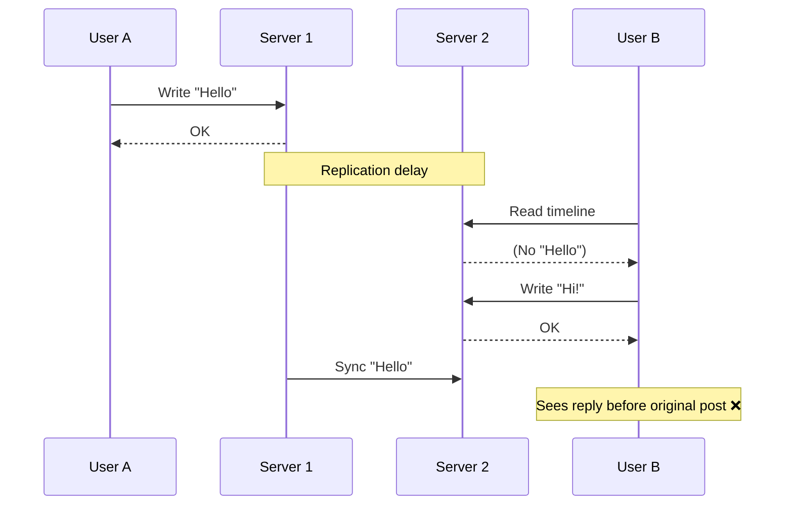

# Consistency

## Types of consistency

- **Strong (ACID)**: Atomicity, Consistency, Isolation, Durability
- **Eventually Consistent**: Consistency, Eventual Consistency, Soft State
- **Weak Consistency**: Consistency, Eventual Consistency, Soft State
- **Leaderless Consistency**: Consistency, Eventual Consistency, Soft State
- **Read your writes consistency**: Consistency, Eventual Consistency, Soft State
- **Monotonic reads consistency**: Consistency, Eventual Consistency, Soft State
- **Causal consistency**: Consistency, Eventual Consistency, Soft State
- **Consistent Prefix read Consistency**: Consistency, Eventual Consistency, Soft State

### Weak Consistency oe Eventual Consistency

- The replication from master to slave is not guaranteed to be consistent.
- There is lag for the replication of the data.
- In terms of wrtite availability, it is better than strong consistency.

### Strong Consistency

- The replication from master to slave is guaranteed to be consistent.
- There is no lag for the replication of the data.
- In terms of write availability, it is lower than weak consistency

### Leaderless Consistency

- Depending on R+W > N (R= Number of read nodes expecting ack, W=Number of write nodes expecting ack)
  - R=1, W=N, Means for read one node should ack but for write N nodes should ack
    - This combination will be more of less availble for write but more availble for read.
  - R=N, W=1, Means for read N nodes should ack but for write one node should ack
    - This combination will be more of less availble for read but more availble for write.
- This combination can convert from weak consistency to strong consistency
- Tunable consistency levels can be used to convert from weak to strong consistency.

### Read your write consistency

- Make sure your write is visible to your read by either sticky session or forwarding the read to write nodes.
- Strong consistency for the write nodes and eventual consistency for other nodes.

### Monotonic reads consistency

- Make sure the read will get the value towards the latest value incrementally.
- This wont give older value from the past.
- This is almost weak/eventual consistency for all the nodes.

### Causal consistency

- The events are not ordered, this cause the data received will be out of order.



- Fix by
  - Sticky session
  - Vector clocks
  - Forwarding the read to write nodes (for read your write consistency)

### Consistent Prefix read Consistency

- How it is seen in the source it will be in order evreyone will see that.
- Consistent prefix read is a combination of monotonic reads and causal consistency.
- If we have 3 version for 3 nodes, then all node see v1,v2, v3
- More of one item, so vector clock is a too complicated solution.
- CPR will be subset of causal consistency.

```text
| Aspect    | Causal Consistency             | Consistent Prefix         |
| --------- | ------------------------------ | ------------------------- |
| Focus     | Dependencies                   | Ordering                  |
| Prevents  | Seeing effect before cause     | Seeing future before past |
| Scope     | Per user / per operation       | Global sequence           |
| Mechanism | Vector clocks, session context | Partition ordering, logs  |
```

```text
Causal → “Why did this happen?”  
Prefix → “In what order did things happen?”
```

#### Achieved by

- Partition-aware routing
- Log ordering (Kafka-style)
- Avoid cross-partition reordering
- Per-partition sequential reads

### More consistency (Microsoft paper on consistency)

- Strong consistency → one reality  
- Eventual consistency → many temporary realities  
- Session guarantees → make it feel correct to users

#### Comparisons

| Consistency Model          | What user might see            | What it guarantees               | What can go wrong             |
| -------------------------- | ------------------------------ | -------------------------------- | ----------------------------- |
| **Strong (Linearizable)**  | 3 → 4 → 5 → 6                  | Always latest                    | High latency                  |
| **Sequential Consistency** | 3 → 4 → 5 → 6 (same for all)   | Same global order                | May not reflect real-time     |
| **Eventual**               | 3 → 3 → 5 → 6                  | Eventually correct               | Arbitrary staleness           |
| **Bounded Staleness**      | 3 → 4 → 4 → 5                  | Limited lag                      | Slight delay                  |
| **Monotonic Reads**        | 3 → 4 → 5 → 5                  | Never goes backward              | May miss latest               |
| **Read Your Writes**       | 5 → 5 → 6                      | See your updates                 | Others may not                |
| **Monotonic Writes**       | Write1 → Write2 always ordered | Writes from same client ordered  | Out-of-order writes otherwise |
| **Writes Follow Reads**    | Read 5 → Write based on 5      | Your writes respect what you saw | Write may go backward         |
| **Causal Consistency**     | Hit → Score                    | Cause before effect              | Independent order undefined   |
| **Consistent Prefix**      | 3 → 4 → 5                      | No reordering                    | May lag                       |

```text
Strong → system truth  
Sequential → shared story  
Session guarantees → user experience  
Causal → logical correctness  
Eventual → eventual convergence
```

#### Grouping of consistency

- Strongest
    Strong (Linearizable)
- Global ordering
    Sequential
    Consistent prefix
- Session guarantees (user-level)
    Read-your-writes
    Monotonic reads
    Monotonic writes
    Writes-follow-reads
- Dependency-based
    Causal
- Weakest
    Eventual

#### Problem and how behaviour

| Problem                     | Fix                |
| --------------------------- | ------------------ |
| Seeing old data             | Eventual / Bounded |
| Seeing backward data        | Monotonic          |
| Not seeing your own update  | Read-your-writes   |
| Seeing reply before message | Causal             |
| Seeing events out of order  | Consistent prefix  |
| Want exact truth            | Strong consistency |
