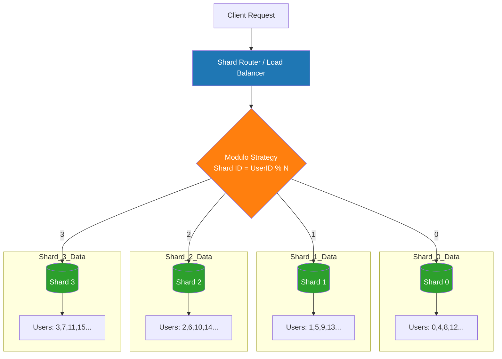
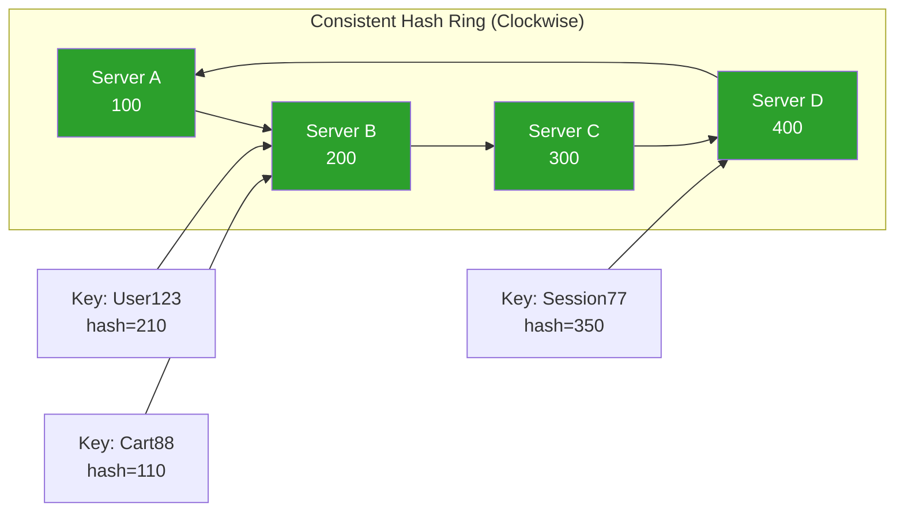
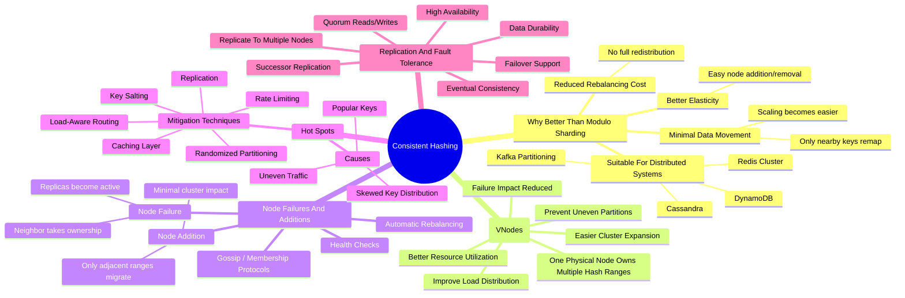

# Consistent Hashing

Consistent caching is data sharding/partitioning technique that evenly distributes the data across nodes in a way that minimizes data movement when nodes are added or removed.

## Basic Hashing

Hashing is a technique to distribute data over different nodes. Data is hashed to a ring and then the hash value is used to distribute the data to the node.



```text
database_id = hash(event_id) % number_of_databases
```

Problem starts when we add a new node to the ring and the data is distributed unevenly.

- This will need to redo the hashing so that new data is distributed evenly.
- The existing data will need to be migrated to the new node. (This is a costly operation)

### Consistent Hashing as a Solution

- Consistent hashing helps the redistribution of data that came from hashing method
- Nodes are placed as nodes on a ring
- Hash value of the key is used to determine which node to send the data to the right node
- If a new node is added, the hash value of the key is used to determine which node to send the data to the right node:w!
- The existing data is migrated to the new node using the hash value of the key



### Removing a Database

- Similarly, if Database 2 (at position 25) fails:
- Only events that were mapped to Database 2 need to move
- These events will now map to Database 3 (at position 50)
- Everything else stays put

### Virtual Nodes

For example, instead of just hashing "DB1" to get position 0, we hash "DB1-vn1", "DB1-vn2", "DB1-vn3", etc., which might give us positions 20, 35, 65 and so on. We do this for each database, which results in the virtual nodes being naturally intermixed around the ring.

Now when Database 2 fails:
The events that were mapped to "DB2-vn1" will be redistributed to Database 1
The events that were mapped to "DB2-vn2" will go to Database 3
The events that were mapped to "DB2-vn3" will go to Database 4
And so on...

#### Hot Spots

- Read replicas: Replicate popular keys across multiple nodes and load-balance reads among them. This is the most common approach.
- Key-space salting: Append a random suffix to hot keys (e.g., mj-{0..9}) so they hash to different nodes. Reads then scatter across those nodes and get aggregated.
- Adaptive rebalancing: Monitor traffic in real-time and move specific key ranges off overloaded nodes. This is operationally complex but some systems (like DynamoDB) do it automatically.

### Real World and Practices

- Consistent hashing tells you where data should live, but it doesn't magically teleport terabytes of data when a node goes down. In practice, most distributed databases use replication alongside consistent hashing to handle failures without moving data at all.
  - For example, DynamoDB replicates each partition across three availability zones. When a primary node fails, a replica is promoted via a consensus algorithm like Raft, and no data needs to move. Cassandra works similarly, replicating data to N consecutive nodes on the ring so reads can be served from surviving replicas.
- Data movement really only happens during planned membership changes like adding capacity or permanently replacing a node to restore the replication factor. Even then, consistent hashing ensures only a bounded fraction of keys need to be re-replicated, not the entire dataset.

- Apache Cassandra: Uses consistent hashing to distribute data across the ring
- Amazon's DynamoDB: Uses consistent hashing under the hood for partition placement
- Content Delivery Networks (CDNs): Use consistent hashing to determine which edge server should cache specific content

#### In the infrastructure interviews

Design a distributed database
Design a distributed cache
Design a distributed message broker

### Deep Dives



