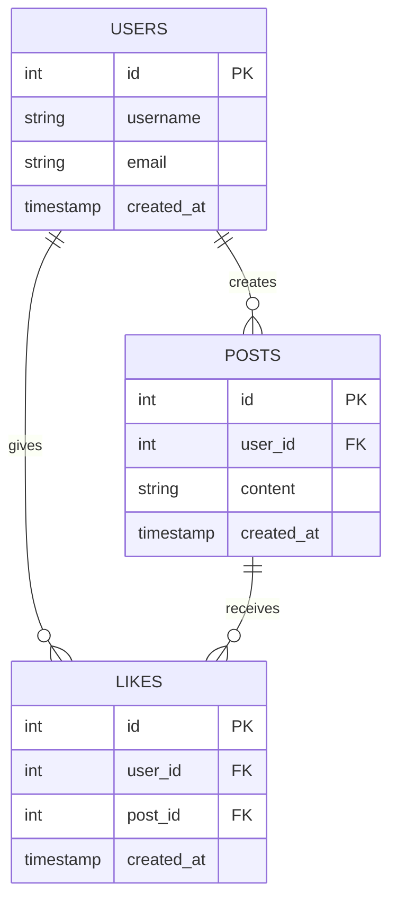
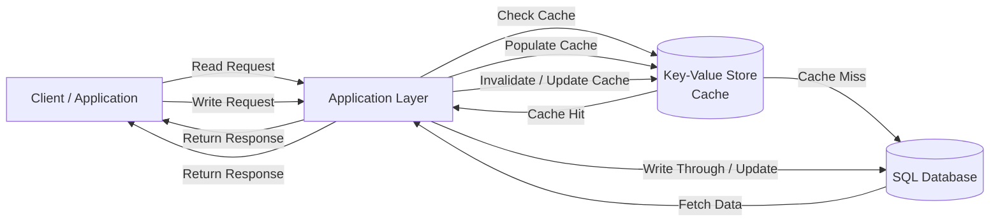
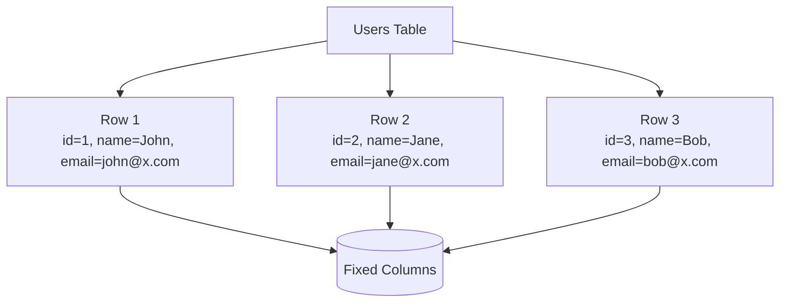
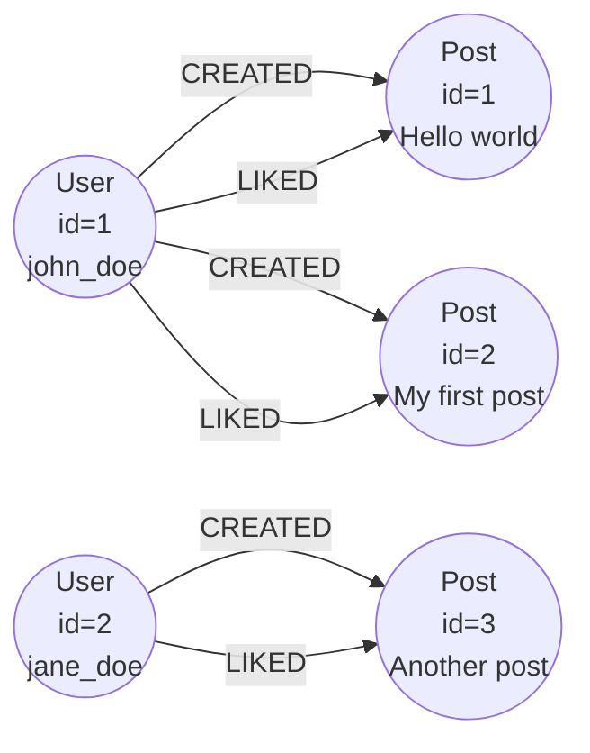
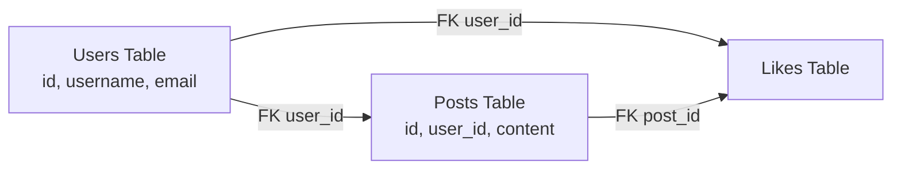
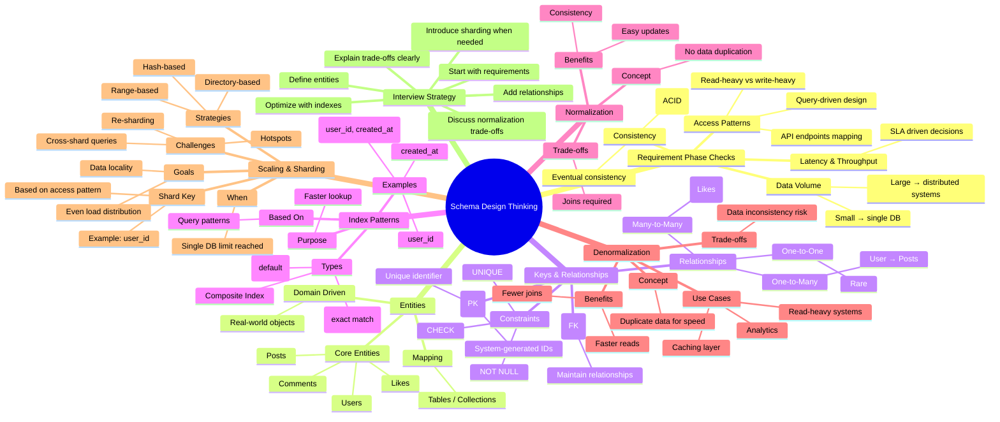

# Data Modeling

- scaling reads and writes, preserving consistency when it matters, and answering questions about growth or auditability without backtracking.
- Unless you have significant experience and, with it, strong opinions about another database, my recommendation is to stick with PostgreSQL.

## Database Model Options

### Relational Databases (SQL)

- organize data into tables with fixed schemas, where rows represent entities and columns represent attributes
- enforce relationships through foreign keys and provide ACID guarantees for transactions.

| id | username  | email                                       | created_at          |
| -- | --------- | ------------------------------------------- | ------------------- |
| 1  | john_doe  | [john@example.com](mailto:john@example.com) | 2024-01-01 10:00:00 |
| 2  | jane_doe  | [jane@example.com](mailto:jane@example.com) | 2024-01-01 10:05:00 |
| 3  | bob_smith | [bob@example.com](mailto:bob@example.com)   | 2024-01-01 10:10:00 |

| id | user_id | content       | created_at          |
| -- | ------- | ------------- | ------------------- |
| 1  | 1       | Hello, world! | 2024-01-01 10:00:00 |
| 2  | 1       | My first post | 2024-01-01 10:05:00 |
| 3  | 2       | Another post  | 2024-01-01 10:10:00 |

| id | user_id | post_id | created_at          |
| -- | ------- | ------- | ------------------- |
| 1  | 1       | 1       | 2024-01-01 10:00:00 |
| 2  | 1       | 2       | 2024-01-01 10:05:00 |
| 3  | 2       | 3       | 2024-01-01 10:10:00 |




- Avoid multitable join, which cause performance traps
- Example: Postgres and MySQL, SQLite

### Document Databases (NoSQL)

- store data as JSON-like documents with flexible schemas, making them good for rapidly evolving applications where you don't know all your data fields upfront
- data modeling becomes more about nesting and embedding related information within documents rather than normalizing across tables

```json
{
  "_id": "507f1f77bcf86cd799439011",
  "username": "john_doe",
  "email": "john@example.com",
  "posts": [
    {
      "content": "Hello, world!",
      "created_at": "2024-01-01T10:00:00Z"
    },
    {
      "content": "My first post",
      "created_at": "2024-01-01T10:05:00Z"
    }
  ],
  "created_at": "2024-01-01T10:00:00Z"
}
```

#### When to consider over SQL

- When your schema changes frequently
- when you have deeply nested data that would require many joins in SQL
- when different records have vastly different structures.
  - user profile system where some users have extensive work histories while others have minimal data fits this pattern.

#### Data modeling impact

- denormalize more aggressively, embedding related data within documents to avoid expensive lookups across collections
  - trades storage space and update complexity for read performance.

- Example: MongoDB, Firestore, and CouchDB.

### Key-Value Databases

- simple lookups where you fetch values by exact key match
- extremely fast but offer limited query capabilities beyond that basic operation.
- For caching, session storage, feature flags, or any scenario where you only need to look up data by a single identifier.
- SQL as your source of truth with a key-value cache (like Redis) in front for hot data.



- Example: Redis, DynamoDB and memcached

### Wide Column Databases

- organize data into column families where rows can have different sets of columns.
- Rows with the same partition key (user_id) are stored together
  - making writes fast (just append to the partition) and reads efficient (scan a contiguous range of a user's posts).

#### How to visualize SQL and Wide Column



```mermaid Wide column Database
flowchart TD

    T[User Table (Wide Column)] --> R1[Row: user_1]
    T --> R2[Row: user_2]

    R1 --> CF1[Profile CF<br/>name=John, email=john@x.com]
    R1 --> CF2[Activity CF<br/>post1=Hello, post2=Hi]

    R2 --> CF1b[Profile CF<br/>name=Jane]
    R2 --> CF3[Preferences CF<br/>theme=dark]

    CF1 --> FLEX[(Flexible Columns)]
    CF2 --> FLEX
    CF3 --> FLEX
```

#### When to to consider over SQL:

- When you have enormous write volumes, time-series data, or analytics workloads where you primarily append data and run aggregations.
  - Think telemetry, event logging, or IoT sensor data.

#### Data modeling impact

- Time becomes a first-class citizen in your modeling.
- design around query patterns even more than with SQL, often duplicating data across different column families to support various access patterns.

Example: Cassandra, HBase, Bigtable, and TiDB

### Graph Database

- databases store data as nodes and edges, optimizing for traversing relationships between entities.



```text
Instead of = Tables + Foreign Keys + Joins think of Nodes → Relationships → Traversals
```

Example: Neo4j, OrientDB, and ArangoDB

## Schema Design Fundementals

### Requirement Phase checks

- Data Volume
  - Where data lives
  - User data and post data in tow different data stores (performance reason or organizational reasons)
- Access Pattern
  - How data is accessed: News feed for example, recent posts or popular posts (denormalized), design indexes.
  - analytics dashboard that aggregates data across time periods might need different table structures entirely.
- Consistency Requirements
  - EVentual consistency for users adata likes and other attributes
  - Strong consistency for financial data

### Entities, Keys and relationships

- After core entities identification map to table
- users, posts, comments, and likes. Each entity needs a primary key to identify individual records.

``` text
users: id (PK), username, email
posts: id (PK), user_id (FK → users.id), content, created_at
comments: id (PK), post_id (FK → posts.id), user_id (FK → users.id), content
likes: user_id (FK → users.id), post_id (FK → posts.id)
```

Connect with entities:

- One-to-many (1:N): a user has many posts, a post has many comments.
- Many-to-many (N:M): users like many posts, posts are liked by many users.
- One-to-one (1:1): rare in practice, often a sign that two tables should just be merged.

### Indexing for patterns

- Indexes are data structures that help the database find records quickly without scanning every row.

### Normalizing and denormalizing 



```mermaid denormalized
flowchart TD

    D[Posts Table (Denormalized)]
    D --> R1[id=1, user_id=1,<br/>username=john_doe,<br/>email=john@example.com,<br/>content=Hello world]
```

- Where denormaliztion make sense
  - Analytics and reporting systems where you're aggregating data that changes infrequently
  - Event logs and audit trails where you're capturing a snapshot of data at a point in time
  - Heavily read-optimized systems like search engines where consistency is less critical than speed

### Scaling and Sharding

- Avoid hot shards
- Avoid cross-shard transactions

## Mindmap for Schema design



