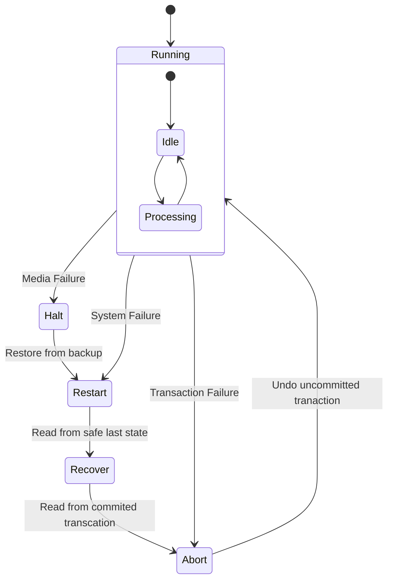
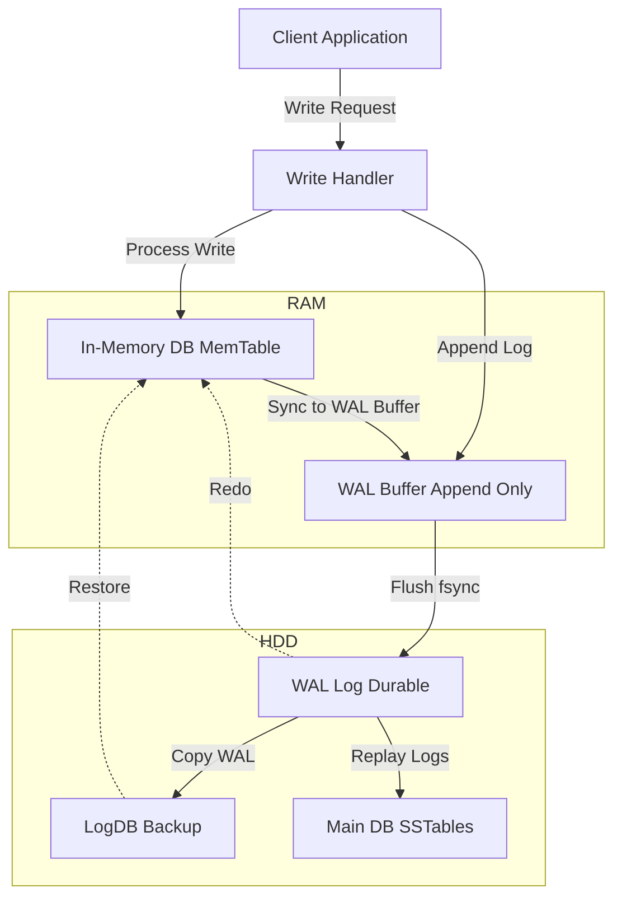

# Data replication

- It improves performance reliability, durability, and availability.

## Database durability

- Transaction failures
  - Network failures
- System failures
- Hardware failures

### State diagram for database durability

#### WAL (Write-Ahead Log)

#### Replication

#### Async write

- Dont wait for all follower they got the data
- Check points:
  - Availability
  - Freshness
  - Consistency
  - Latency

#### Sync write

- wait for all follower that they got the data
  
### What happens if one follower is down?

- Backup / restore (snapshot)
- Sync from leader to get the latest data

### How to elect the leader?

- whoever has the latest data
- leader election protocols
- ZooKeeper, etcd, Consul

### How to know if leader is down?

- Heartbeat
- Election timeout

### Decoupling and replication

- Having WAL versions
- DB versions
- It should be compactible
- Havinf interface layer between log and db so that any log can be played against any db

### How to maintain replicated logs

- Timestamps and commands
- Decoupling with storage engine
- Trigger for replicate - Rows and conditions

