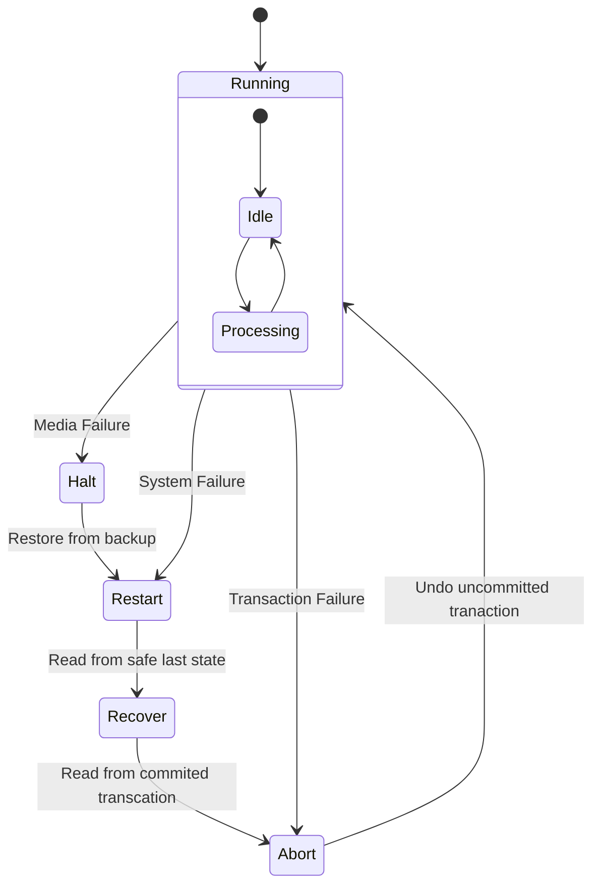

# Data replication

- It improves performance reliability, durability, and availability.

## Database durability

- Transaction failures
  - Network failures
- System failures
- Hardware failures

### State diagram for database durability

