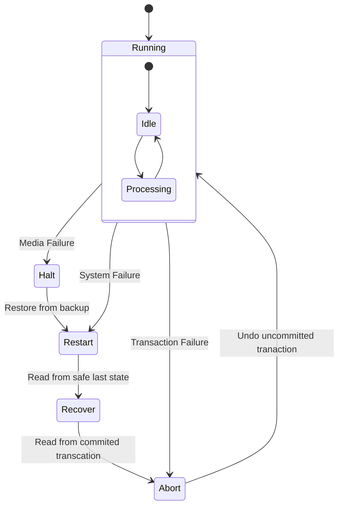
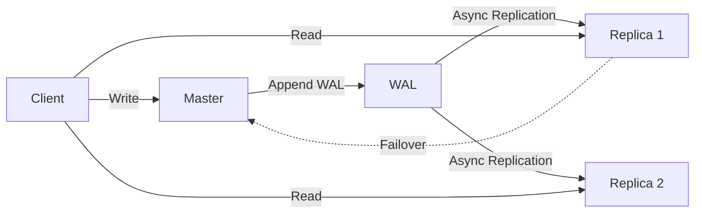
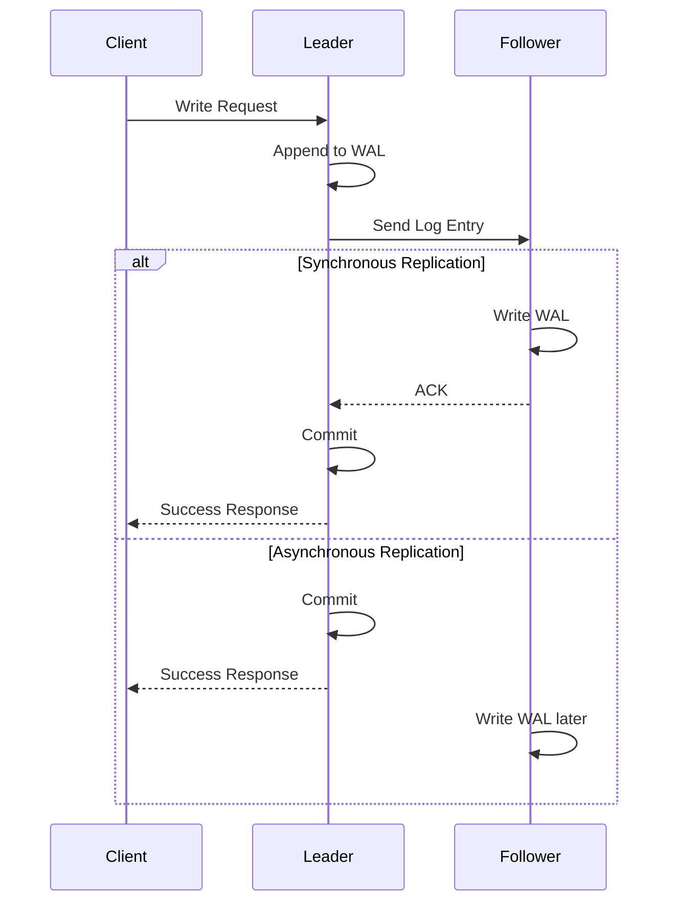
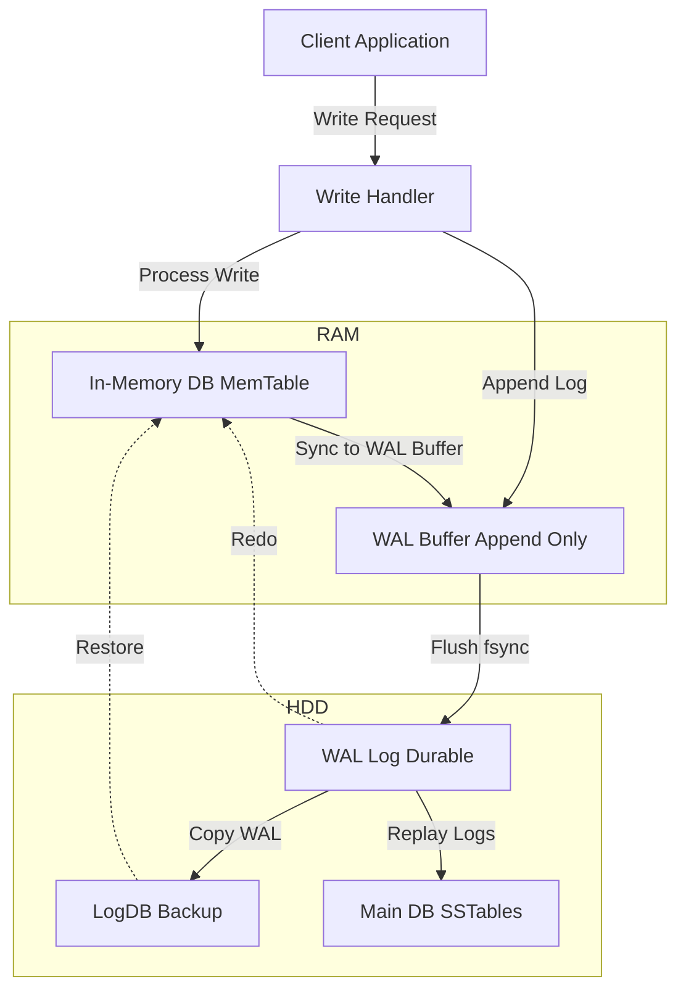
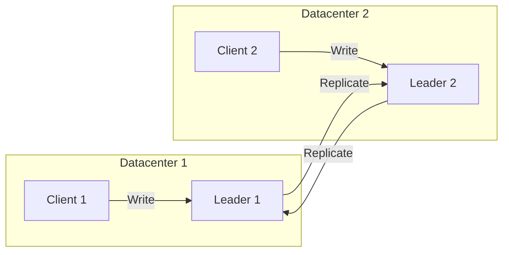
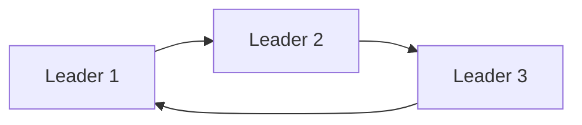
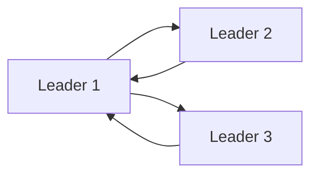
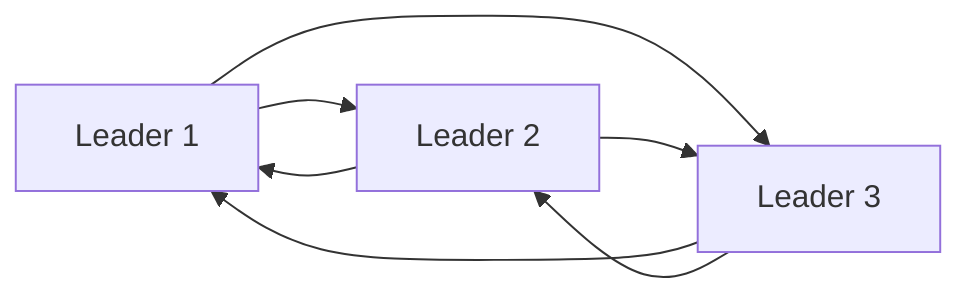
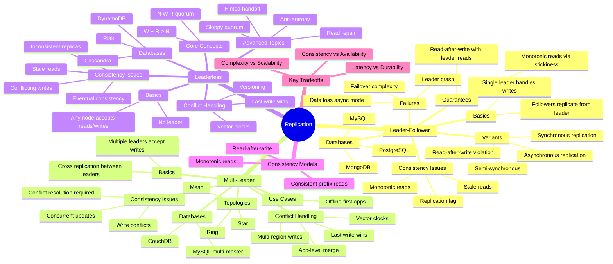

# Data replication

- It improves performance reliability, durability, and availability.

## Database durability

- Transaction failures
  - Network failures
- System failures
- Hardware failures

### State diagram for database durability

```mermaid
stateDiagram-v2

    [*] --> Running

    state Running {
        [*] --> Idle
        Idle --> Processing
        Processing --> Idle
    }

    Running --> Halt : Media Failure
    Halt --> Restart : Restore from backup
    Running --> Restart: System Failure
    Restart --> Recover: Read from safe last state
    Recover --> Abort: Read from commited transcation
    Abort --> Running: Undo uncommitted tranaction
    Running --> Abort: Transaction Failure
```

#### Replication

##### Async Replication

- Dont wait for all follower they got the data
- Check points:
  - Availability
  - Freshness
  - Consistency
  - Latency

#### Sync Replication

- wait for all follower that they got the data
  
#### Decoupling and replication

- Having WAL versions
- DB versions
- It should be compactible
- Havinf interface layer between log and db so that any log can be played against any db

#### How to maintain replicated logs

- Timestamps and commands
- Decoupling with storage engine
- Trigger for replicate - Rows and conditions

## Replication Pattern in distributed design

- Single leader:
  - Active-Passive/Leader-Follower/Master-slave

```mermaid
flowchart LR

    A[Client] -->|Write| B[Master]

    B -->|Append WAL| C[WAL]
    C -->|Async Replication| D[Replica 1]
    C -->|Async Replication| E[Replica 2]

    A -->|Read| D
    A -->|Read| E

    D -.->|Failover| B
```

- Leader is always updated
  - Writes goes only to leader
- Replicas is always updated with change of stream, will be send to followers by leader
- Read can be always sent to either leader of follower
- Mode of replication is by default available in most pgsql, mysql, In MongoDB
  - Leader based replica is also available for kafka

SYnchronos replication, Asynchronous replication or semi synchronous

- Synchronous replication
- Asynchronous replicationALways a n updae in leader trigger a change to follower.
- One always a node which is upto-date  

- Semi-Synchronous
  - One follower will always be in sync with leader
  - ANother follower will be sometime off sync or asycnhronously synced with leader
  - If leader node is crashed there is always a new leader converted from a synchronour follower

```mermaid
sequenceDiagram
    participant C as Client
    participant L as Leader
    participant F as Follower

    C->>L: Write Request
    L->>L: Append to WAL

    L->>F: Send Log Entry

    alt Synchronous Replication
        F->>F: Write WAL
        F-->>L: ACK
        L->>L: Commit
        L-->>C: Success Response
    else Asynchronous Replication
        L->>L: Commit
        L-->>C: Success Response
        F->>F: Write WAL later
    end
```

### What happens if one follower is down

- Backup / restore (snapshot)
- Sync from leader to get the latest data

#### How to know if leader is down?

- Heartbeat and Timeout

### How to elect the leader?

- whoever has the latest data
- leader election protocols (consessus protocols)
- ZooKeeper, etcd, Consul
- Old leader when coming back should not be leader and follow the new leader

#### Failure Recovery

- Easiest way is to discard write if new leaders data is old.
  - Disgarding writes is also dangerous which can bring more problems like when syncing with datbase to sync with storage
- Split brain
  - Recovery by shutting down one leader

Note: *All mentioned problems affect "Consistency, availability, durability, latency*

### How to replicate across multiple nodes

#### Statement based replication

- Each statement on the database (leader) is replicated to each node (follower)
- BreakDown on
  - RAND(), NOW() make sense on the leader not on the follower while replicating using statement
  - AUto incrementing primary key make sense on the leader not on the follower while replicating using statement

Example:
    - Still used in MYSQL-5.1

#### WAL (Write-Ahead Log)

```mermaid
flowchart TB
    %% Client Layer
    A[Client Application] -->|Write Request| B[Write Handler]

    %% RAM Layer
    subgraph RAM
        C[In-Memory DB MemTable]
        D[WAL Buffer Append Only]
    end

    %% HDD Layer
    subgraph HDD
        E[WAL Log Durable]
        F[LogDB Backup]
        G[Main DB SSTables]
    end

    %% Write Flow
    B -->|Process Write| C
    B -->|Append Log| D
    C -->|Sync to WAL Buffer| D

    %% WAL Persistence
    D -->|Flush fsync| E

    %% Replication
    E -->|Copy WAL| F

    %% Apply to DB
    E -->|Replay Logs| G

    %% Recovery
    E -.->|Redo| C
    F -.->|Restore| C
```

Advantages:
    - Strong coupling with format and storage engine of database
    - Strong version lockdowns of the database and format of the WAL

Replication Lag:
    -   If leader is updated with data, the follower will eventually catch up. This lag is called replication lag.

Read-after-write consistency:
    -   If a write is committed, it is visible to all replicas but the in between the folowers are updated with the data if there is read request data will be old.
        -   So if there is a write request and a read request, the read request will be routed to the leader and it will return the latest data.
            -   How to identify the read-after-write query, it can be any read in between replication lag time it should go to leader.

Monotonic Read:

- If the read goes to random follower , it may get different in time.
  - One follower may have different data than another follower. One read would be latest and another read would be old.
  - So the read should be always monotonic.
    - Always read from the same follower.

- Multi-Leader:
  - Master-master
    - Write accepted by multiple node.
    - Because single leader failure can cause data loss
    - Multi-leader database is for multi-datacenter

```mermaid
flowchart LR

    %% Datacenter 1
    subgraph DC1 [Datacenter 1]
        A[Client 1]
        L1[Leader 1]
        A -->|Write| L1
    end

    %% Datacenter 2
    subgraph DC2 [Datacenter 2]
        B[Client 2]
        L2[Leader 2]
        B -->|Write| L2
    end

    %% Cross-DC replication
    L1 -->|Replicate| L2
    L2 -->|Replicate| L1
```

Example: Tungsten Replicator for MYSQL, BDR for postgresql, GoldenGate for oracle

- Usecases:
  - Client with offline activity:
    - local client update is updated to local data and then synced whenever possible.
      - GPS watch etc
  - Conflict resolving editing or collaborative editing
    - sync fast with local database and then sync with remote database with conflict resolution place
    - Google docs shared document.

##### How to handle write conflict

- Conflict free replicated data types
  - multiple datastructure usage with maps, ordered list, counters.
  - Example:
    - Riak
- Mergable persistent data types
  - Git like
- Operational transformation
  - Google docs, etherpad

#### Multi-leader Topologies

- Circular Topology

```mermaid
flowchart LR

    L1[Leader 1] --> L2[Leader 2]
    L2 --> L3[Leader 3]
    L3 --> L1
```

- Star Topology

```mermaid
flowchart LR

    L1[Leader 1]

    L1 --> L2[Leader 2]
    L1 --> L3[Leader 3]

    L2 --> L1
    L3 --> L1
```

- All-to-all Topology

```mermaid
flowchart LR

    L1[Leader 1] --> L2[Leader 2]
    L1 --> L3[Leader 3]

    L2 --> L1
    L2 --> L3

    L3 --> L1
    L3 --> L2
```

| Topology | Latency | Fault Tolerance | Complexity | Usage   |
| -------- | ------- | --------------- | ---------- | ------- |
| Ring     | High    | Low             | Low        | Rare    |
| Star     | Medium  | Medium          | Medium     | Limited |
| Mesh     | Low     | High            | High       | Common  |

- Leaderless:

- Successful write is assumed to be R + W > N
- This configuration is configurable.
- Hindted Handoff and Sloppy quorums:
  - If the leader fails, the write is not guaranteed to be successful.

## Summary

```mermaid
mindmap
  root((Replication))

    Leader-Follower
      Basics
        Single leader handles writes
        Followers replicate from leader
      Consistency Issues
        Replication lag
        Read-after-write violation
        Monotonic reads
        Stale reads
      Guarantees
        Read-after-write with leader reads
        Monotonic reads via stickiness
      Failures
        Leader crash
        Failover complexity
        Data loss async mode
      Variants
        Synchronous replication
        Asynchronous replication
        Semi-synchronous
      Databases
        PostgreSQL
        MySQL
        MongoDB

    Multi-Leader
      Basics
        Multiple leaders accept writes
        Cross replication between leaders
      Use Cases
        Multi-region writes
        Offline-first apps
      Consistency Issues
        Write conflicts
        Concurrent updates
        Conflict resolution required
      Conflict Handling
        Last write wins
        App-level merge
        Vector clocks
      Topologies
        Ring
        Star
        Mesh
      Databases
        CouchDB
        MySQL multi-master

    Leaderless
      Basics
        No leader
        Any node accepts reads/writes
      Core Concepts
        N W R quorum
        W + R > N
      Consistency Issues
        Eventual consistency
        Stale reads
        Conflicting writes
        Inconsistent replicas
      Advanced Topics
        Sloppy quorum
        Hinted handoff
        Read repair
        Anti-entropy
      Conflict Handling
        Versioning
        Vector clocks
        Last write wins
      Databases
        Cassandra
        DynamoDB
        Riak

    Consistency Models
      Read-after-write
      Monotonic reads
      Consistent prefix reads

    Key Tradeoffs
      Consistency vs Availability
      Latency vs Durability
      Complexity vs Scalability
```
