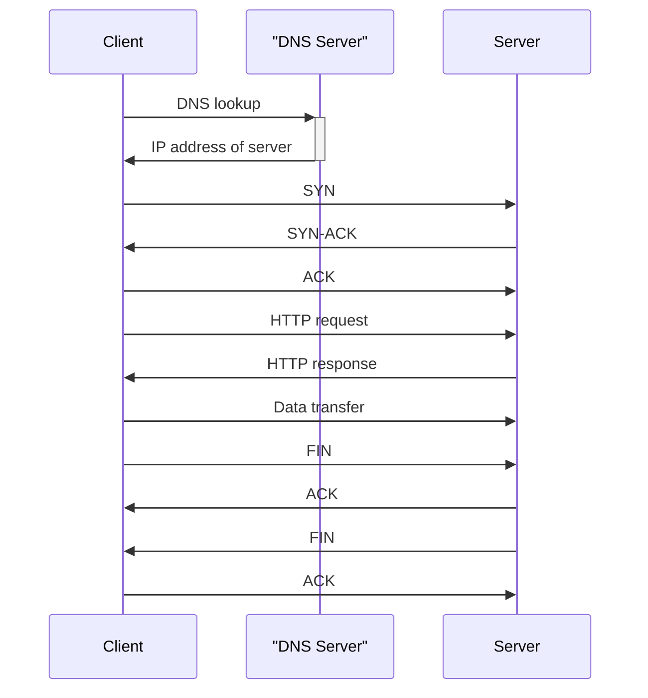
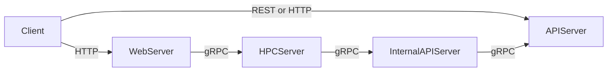

# Networking 101

## Network Layers

Three key layes most of the time need to be understand:

- Network layer [Layer 3]
- Transport layer [Layer 4]
- Application layer [Layer 7]

Network layer:

This layer, IP layer, is responsible for support routing, addressing to the network, and packet forwarding.

- IP address:
  - Can be uniquely identified by a 32 bit number (IPv4) or 128 bit number (IPv6).

There are other protocol like infiband which is used to support high speed data transfer. But more of this discussion is in IP layer.

Transport layer:

This layer, TCP/UDP layer, is responsible for support connection, data transfer, and error detection, flow control, and retransmission.

- TCP:
- QUIC:
- UDP:

Application layer:

This layer, HTTP layer, is responsible for support client-server interaction, data exchange, and data processing.

Protocols like DNS, SMTP, HTTP, and SSH are all application layer protocols.

### What happens when you type a URL to visit a website?



Steps:

1. DNS Resolution: The client starts by resolving the domain name of the website to an IP address using DNS (Domain Name System).
2. TCP Handshake: The client initiates a TCP connection with the server using a three-way handshake:
3. SYN: The client sends a SYN (synchronize) packet to the server to request a connection.
4. SYN-ACK: The server responds with a SYN-ACK (synchronize-acknowledge) packet to acknowledge the request.
5. ACK: The client sends an ACK (acknowledge) packet to establish the connection.
6. HTTP Request: Once the TCP connection is established, the client sends an HTTP GET request to the server to request the web page.
7. Server Processing: The server processes the request, retrieves the requested web page, and prepares an HTTP response. (This is usually the only latency most SWE's think about and control!)
8. HTTP Response: The server sends the HTTP response back to the client, which includes the requested web page content.
9. TCP Teardown: After the data transfer is complete, the client and server close the TCP connection using a four-way handshake:
10. FIN: The client sends a FIN (finish) packet to the server to terminate the connection.
11. ACK: The server acknowledges the FIN packet with an ACK.
12. FIN: The server sends a FIN packet to the client to terminate its side of the connection.
13. ACK: The client acknowledges the server's FIN packet with an ACK.

### Hidden activities

- Application layer dont need to know the reliablity and ordering how the packet arrives at the destination.
- Network layer need to know the reliability and ordering how the packet arrives at the destination which is basically addressed when using TCP.
- For DNS query you just get the IP address.
- Many request and response in this use case which add more latency and processing required.
- State of the client and server should be maintained. HTTP keep-alive or HTTP2-Multiplexing.

## Network layer

Dominated by IP protocl this layer responsible for routing and addressing.

- DHCP server: Gives the IP address on bootup for you node/host if it is configured to get it automatically.
- The IP address need to be unique to each node/host and if it is public facing it should be know to everyone. RIR (Registry of Internet Resources) is used to register the IP address.
- Public IP address: 0.0.0.0 to 89.0.142.86 and 237.84.2.178 to 244.178.44.111

## Transport layer

Dominated by TCP protocl this layer responsible for connection, data transfer, and error detection, flow control, and retransmission.

- UDP: User Datagram Protocol (Fast and unreliable)
The UDP packet received will tell source IP and port number and destination IP and port number. Remaining are binary blob.

Features of UDP are:

- Connectionless
- No guarantee of delivery
- No guarantee of order
- Lower Latency

Speed vs reliability tradeoff. If speed is needed pick UDP elese TCP.

Uses in:
    -   Online Games
    -   Video Streaming
    -   VOIP
    -   WebRTC
    -   DNS
    -   DHCP

- TCP: Transmission Control Protocol (Reliable and ordered)
Everything on the internet works with TCP, reliable, ordered, error-checked delivery of data. Establish with 3 way handshake. One connection throughout the communication. This is called a *stream* and is a *stateful connection*.

Features of TCP are:

- Connection Oriented
- Guarantee of Delivery
- Flow Control
- Congestion Control

#### When to choose a specific protocol:

Most of the cases it will TCP unless specificed otherwise like:

- Low latency is critical (real-time applications, gaming)
- Some data loss is acceptable (media streaming)
- Handling high-volume telemetry or logs where occasional loss is acceptable
- If no need to support web browsers (or you have an alternative for that client)

#### TCP vs UDP comparison:

| Feature            | UDP                     | TCP                    |
|--------------------|-------------------------|------------------------|
| Congestion Control | No                      | Yes                    |
| Connection         | Connectionless          | Connection-oriented    |
| Flow Control       | No                      | Yes                    |
| Header Size        | 8 bytes                 | 20–60 bytes            |
| Ordering           | No ordering guarantees  | Maintains order        |
| Reliability        | Best-effort delivery    | Guaranteed delivery    |
| Speed              | Faster                  | Slower due to overhead |
| Use Cases          | Streaming, gaming, VoIP | Everything else        |

## Application layer

### HTTP: Hypertext Transfer Protocol

- Dominated by HTTP protocl this layer responsible for client-server interaction, data exchange, and data processing.
- Stateless protocol.
- Request and Response
- Key Concepts:
  - Request Method: GET, POST, PUT, DELETE
  - Status Code: 200, 404, 500 etc.
  - Headers: Content-Type, Content-Length, etc.
  - Body: Data sent in the request or response body.

Status Codes:

- 200: OK
- 201: Created
- 202: Accepted
- 204: No Content
- 301: Moved Permanently
- 302: Found
- 304: Not Modified
- 400: Bad Request
- 401: Unauthorized
- 403: Forbidden
- 404: Not Found
- 500: Internal Server Error
- 502: Bad Gateway
- 503: Service Unavailable

HTTP headers:

HTTP headers are key-value pairs that are used to pass additional information about the request or response.

- Content-Encoding: gzip, deflate, br
- Content-Type: text/html, application/json, etc.
- Content-Length: number of bytes in the body

#### HTTPS: HTTP over TLS

- Transport Layer Security (TLS) is a security protocol that provides encryption and authentication for data transmitted over the internet.
- It is a secure protocol that uses public-key infrastructure (PKI) to establish a secure connection between a client and a server.
- It uses SSL (Secure Sockets Layer) and TLS (Transport Layer Security) protocols to establish a secure connection between a client and a server.
- It provides end-to-end encryption and authentication for data transmitted over the internet.

## Communication of the services:

### REST: Representational State Transfer:

- Consider of having action on resources and getting information from resources.
- Resource can be anything.
- Primary focus on stateless services and action perform on resources. Borrowed verbs from HTTP.
- JSON to represent resources.

Requesting a resource to GET resource id using *id*:

```json
GET /users/{id} -> User
```

Updating the resource to PUT resource id using *id*:

```json
PUT /users/{id} -> User
{
  "username": "john.doe",
  "email": "john.doe@example.com"
}
```

Where to use REST:

- Elastic search uses to manage document, configure indexes, etc.
- Not good option on high throughput services.
- Better default to REST + TCP, if not then gRPC, SSE, WebSockets

### GraphQL: Graph Query Language

- API designed by Facebook to query data from a server.
- GraphQL is a query language for APIs and a runtime for executing queries by a server.
- Address under-fetching and over-fetching to ask the server exactly what data they need.

What it avoids:

- cobble together a bunch of different requests to backend endpoints (imagine querying 1 API for a list of users and making 10 API calls to get their details)
- create huge aggregation APIs which are hard to maintain and slow to change
- write brand new APIs for every new page they want to display.
- Too many data in single call creates long time to load.


So the GraphQL queries will be asked in the query by frontend and backend respond to the query which is applicable to frontend by backend.

```graphql
query GetUsersWithProfilesAndGroups($limit: Int = 10, $offset: Int = 0) {
  users(limit: $limit, offset: $offset) {
    id
    username
    //...
    
    profile {
      id
      fullName
      avatar
      // ...
    }
    
    groups {
      id
      name
      description
      // ...
      
      category {
        id
        name
        icon
      }
    }
    
    status {
      isActive
      lastActiveAt
    }
  }
  
  _metadata {
    totalCount
    hasNextPage
  }
}
```

Where to use GraphQL:

- Ideal for frontend team to iterate quickly and adjust.
- GraphQL query can create latency and complexity.
- Good to have balance between complexity of clients and multple team making overlapping data requests.

### gRPC: Google Remote Procedure Call

- developed by Google.
- uses HTTP2 and protocol buffers.
- rigid schema and message efficient serialization.
- definition for the resource and service definition.
- No stream support for gRPC, no browser support till today.

Resource definition for User:

```protobuf
message User {
  string id = 1;
  string name = 2;
}
```

User service schema:

```protobuf

message GetUserRequest {
  string id = 1;
}

message GetUserResponse {
  User user = 1;
}

service UserService {
  rpc GetUser (GetUserRequest) returns (GetUserResponse);
}
```

Where to use gRPC:

- Ideal for microservice architecture.
- Its strong typing helps catch errors at compile time rather than runtime
- Its binary protocol is more efficient than JSON over HTTP (some benchmarks show a factor of 10x throughput!).
- Consider gRPC for internal service-to-service communication, especially when performance is critical or when latencies are dominated by the network rather than the work the server is doing.

When to use gRPC and REST:

- gRPC is used for internal service-to-service communication.
- REST is used for external service-to-service communication. [External facing API]

Picturise the communication:



### SSE: Server-Sent Events

- Driven by server, pushong multiple messages to client over HTTP.
- When client tries to connect server, server opens a connection and keep it open. Tracks the connection if needs to open again if it was closed because of network elements.
- Multiple message comes from server to client over one TCP connection.

```text
data: {"id": 1, "timestamp": "2025-01-01T00:00:00Z", "description": "Event 1"}
data: {"id": 2, "timestamp": "2025-01-01T00:00:01Z", "description": "Event 2"}
...
data: {"id": 100, "timestamp": "2025-01-01T00:00:10Z", "description": "Event 100"}
```

where to use SSE:

- Ideal for real-time updates.
- Good for push notifications.
- you only need server → client updates
- You want simple real-time streaming
- You prefer HTTP-based infra (CDN, proxies, etc.)

When not to use SSE:

- Bad for real-time updates.
- Low latecy realtime update
- Connection might get closed by intermediate nodes because of timeout so server need to track the client and reconnect.
- So the SSE standard defines the behavior of an EventSource object that, once the connection is closed, will automatically reconnect with the ID of the last message received.

### WebSockets: RealTime bidirectional sockets

- TCP connection between client ans server
- Bidirectional communication and streaming of data. Though gRPC support it it doesnt support browser support.
- Can be used by upgrade capability of HTTP.

How it works:

- Client initiates WebSocket handshake over HTTP (with a backing TCP connection)
- Connection upgrades to WebSocket protocol, WebSocket takes over the TCP connection
- Both client and server can send binary messages to each other over the connection
- The connection stays open until explicitly closed

where to use WebSockets:

- High-frequency, persistent, bi-directional communication between client and server. 
- Think real-time applications, games, and other use-cases where you need to send and receive messages as soon as they happen.

When not to use WebSockets:

- Just for real-time updates(it is an overkill).
- If infra not supporting WebSockets.

### WebRTC: Peer to peer real time communication:

- Uses UDP.
- Direct use of communication between client browser with server.
- Spec and interfaces are defined by W3C.

Use of STUN and TURN servers:

- STUN: "Session Traversal Utilities for NAT" is a protocol and a set of techniques like "hole punching" which allows peers to establish publically routable addresses and ports. It's a standard way to deal with NAT traversal and it involves repeatedly creating open ports and sharing them via the signaling server with peers.
- TURN: "Traversal Using Relays around NAT" is effectively a relay service, a way to bounce requests through a central server which can then be routed to the appropriate peer.

How it works:

- client talk to central signaling server, it tracks the peers.
- client has the connection information for another peer, they can try to establish a direct connection without going through any intermediary servers.
- most clients don't allow inbound connections for security reasons and the majority of users are behind a NAT (network address translation) device which keeps them from being connected to directly.
- Clients connect to a central signaling server to learn about their peers.
- Clients reach out to a STUN server to get their public IP address and port.
- Clients share this information with each other via the signaling server.
- Clients establish a direct peer-to-peer connection and start sending data.

Where to use WebRTC:

- WebRTC is ideal for audio/video calling and conferencing applications
- collaborative applications like document editors, especially if they need to scale to many clients.
- Alternative CRDT (Conflict-Free Replicated Data Types) for collaborative applications.
