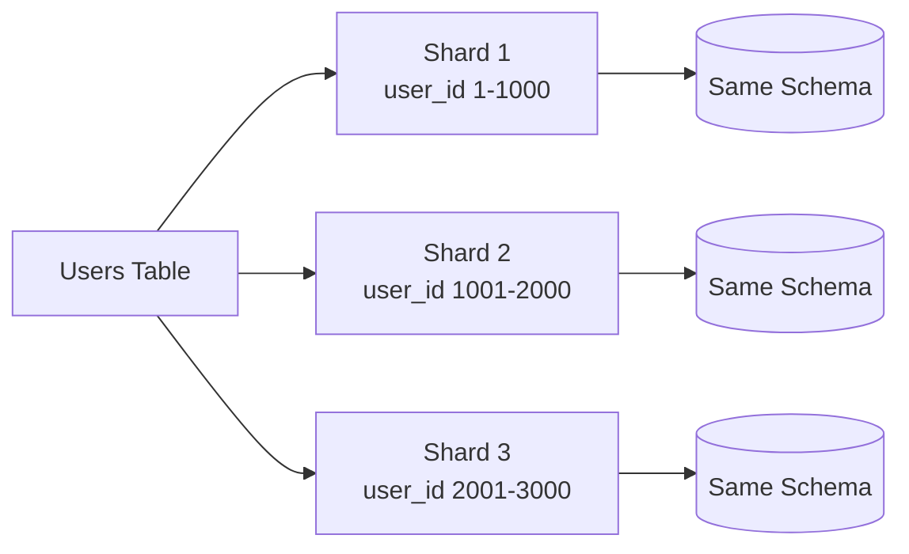
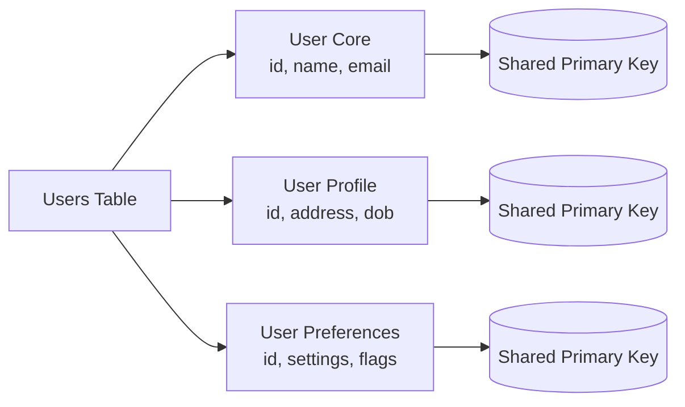
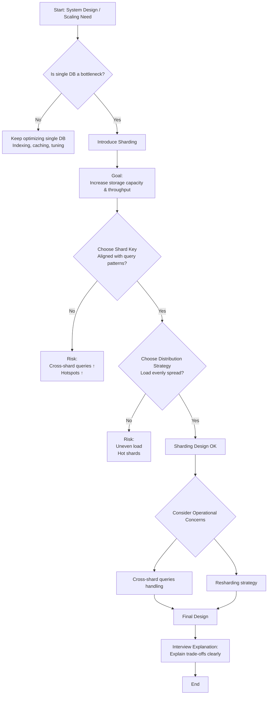

# Sharding and Data Partitioning

- Simplest way to differentiate is that
  - Shard is dividing the data over multiple systems
  - Partitioning is didviding the data over multiple tables in the same machine

## Partioning

- Partitioning is dividing the data over multiple tables in the same machine
- Different partioning strategies:

### Horizontal Partitioning

- Split rows across partitions : Example: One partition depending on year
- Same columns with fewer rows



### Vertical Partitioning

- Split column across partitions : Example: higest accessed columns in one table and less accessed columns in another table
- Same rows but fewer columns per partition



## Sharding

- shard is a standalone database with its own CPU, memory, storage, and connection pool
- sharding solves the problem of scaling but introduce how to create shard key, route the query to right shard
  
### How to shard the data

- High cardinality: The key should have many unique values. For example, the user_id column in the users table has a high cardinality because it has many unique values.
- Even Distribution: The key should have a distribution that is even. For example, the user_id column in the users table has a distribution that is even because it has many unique values.
- Align with queries: Query should hit only one shard. For example, the user_id column in the users table is aligned with queries that are made to retrieve user data.
  
For example: 

- user_id column in the users table is aligned with queries that are made to retrieve user data
- order_id column in the orders table is aligned with queries that are made to retrieve order data

Which shouldn't be shard key are:

- is_good: which is boolean table become very small
- created_at: which is timestamp and ever growing recent writes to recent shard (hot spot) older ones dont have any shards.

### Sharding strategies

#### Range based sharding

- Range based sharding is easiest one
- It just groups records by a continuous range of values. You pick a shard key like user_id or created_at, then assign value ranges to shards.

```text
Shard 1 → User IDs 1–1M
Shard 2 → User IDs 1M–2M
Shard 3 → User IDs 2M–3M
```

Where it is used:

- SaaS platforms (CRM, HR tools, billing systems)
- Used alongside relational DBs like PostgreSQL
- Also appears in distributed systems like Google Bigtable (range tablets)

#### Hash based sharding

- take a shard key like user_id, hash it, and use the result to pick a shard.
- hash-based sharding is even distribution.
- downside shows up when you need to add or remove shards. 
  - If you go from 4 shards to 5, the modulo operation changes from % 4 to % 5, which means almost every record maps to a different shard. You have to move massive amounts of data around.
  - Use consistent-hashing instead.

```text
shard = hash(user_id) % 4

User 42  → hash(42) % 4 = Shard 2
User 99  → hash(99) % 4 = Shard 3
User 123 → hash(123) % 4 = Shard 1
```

#### Directory based sharding

- Kind of lookup table

```
user_to_shard
---------------
User 15   → Shard 1
User 87   → Shard 4
User 204  → Shard 2
```

Good:

- If a particular user generates tons of traffic, you can move them to a dedicated shard.
- If you need to rebalance load, you just update the mapping table. 
- You can implement complex sharding logic that would be impossible with a simple hash function.
  
Not good:

- The downside is that every single request requires a lookup
- adds latency to every request and makes the directory service a critical dependency.
- Also, it requires a directory service to keep track of the shard assignments.
- If the directory goes down, your entire system stops working even if all the data shards are healthy.

## Challenge:

- Uneven shards
- Hot-spots
- consistency maintenance

### Hot spot 

#### Celebrity problem

- celebrity problem: when a single entity is accessed by a huge number of queries.
- Problem is not strategies it is key is inherently user is more active than other user.
- It can be tackled using *directory based sharding* with celebrities in one dedicated shard.

#### How to detect hotspot:

- query latency, CPU usage, and request volume. 
- When one shard consistently shows higher metrics than others, you have a hot spot problem.

#### How to handle hot spot:

- Isolate hot keys to dedicated shards: 
- Use compound shard keys
  - spreads a single user's data across multiple shards over time, which helps if the hot spot is both high volume and spans time periods.
  - Use multiple shard keys: user_id + created_at
- Dynamic shard splitting
  - databases support automatically splitting a shard when it gets too large or too hot.
  - MongoDB's balancer will split and migrate range-based chunks (including when using a hashed shard key) to maintain balance.
  - Vitess supports online resharding, but it is operator-driven (initiated and managed by operators), not automatic.

### Cross-Shard operations

- When your data lives on multiple machines, any query that needs data from more than one shard becomes expensive.

### How to avoid cross-shard operations

- Cache the results
- If "top 10 most popular posts" requires hitting all shards, cache the result for 5 minutes. 
  - The first query is expensive, but the next thousand requests hit the cache instead of querying 64 shards.
- Denormalize to keep related data together
  - frequently need to query posts along with user data, store some post information directly on the user's shard.
  - Update will be complex but worth it by keeping everything in one shard.
- Accept the hit for rare queries: 

Maintaing consistency

- Quering multiple shard is a problem but how to get the consistency
- 2 Phase commit dont help here, slow and fragile
  - where a coordinator asks all shards to prepare the transaction, waits for everyone to confirm they're ready, then tells everyone to commit

Design to avoid cross-shard transactions:

- If you shard users by user_id, keep all of a user's data on their shard. Account balance, transaction history, profile information, all on one shard.

Use sagas for multi-shard operations:

- When you absolutely need to coordinate across shards, use the saga pattern.
  - Break the operation into a sequence of independent steps, each with a compensating action. 
    - If step 3 fails, you run compensating actions for steps 2 and 1 to undo the work. 
    - For example, transferring money between users on different shards:
      - Deduct money from User A's account (shard 1)
      - Add money to User B's account (shard 2)
      - If step 2 fails, refund User A (compensating action)

Accept eventual consistency

- If you're updating a user's follower count and that count is denormalized across multiple shards for fast profile lookups
- *If you find yourself constantly needing distributed transactions, you probably chose the wrong shard key or the wrong shard boundaries.*

### Modern Databases and Sharding

- Cassandra, DynamoDB, MongoDB: specify a partition key and handle the rest
  - Cassandra uses murmur3parititioner hash function with virtual nodes
- DynamoDB: hashes the partition key to route items to internal partitions and splits/merges partitions as they grow
- MongoDB: shards data into range-based chunks on the shard key. If you choose a hashed shard key, the ranges are over the hash space.
- SQL used opensource Vitess and Citus opensource sharding layer.

## When to mention sharding

- Storage: "We have 500M users with 5KB of data each, that's 2.5TB. A single Postgres instance can handle that, but if we grow 10x we'll need to shard."
- Write throughput: "We're expecting 50K writes per second during peak. A single database will struggle with that write load, so we should shard."
- Read throughput: "Even with read replicas, if we're serving 100M daily active users making multiple queries each, we'll need to distribute the read load across shards."

## Summary



