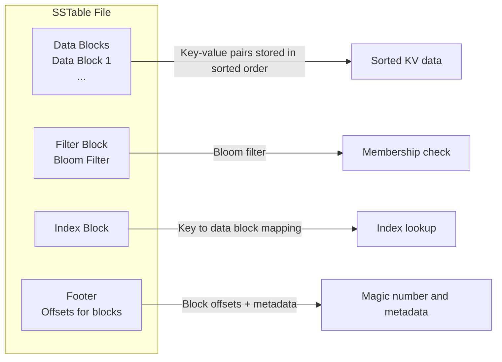
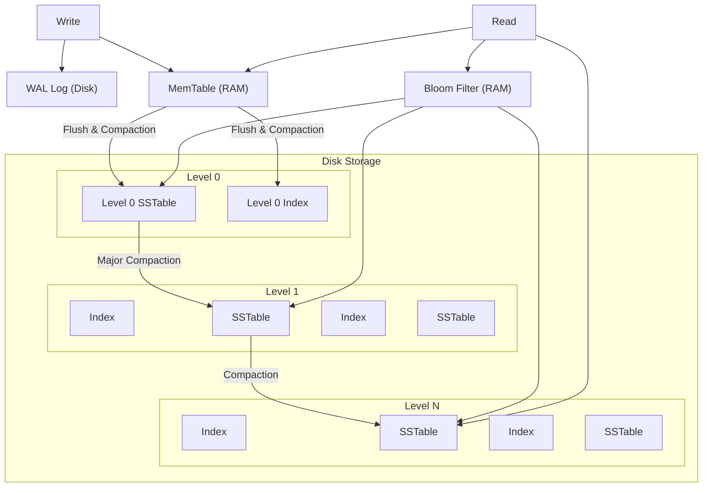
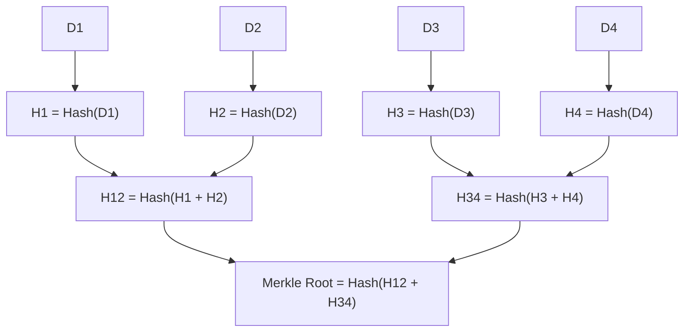
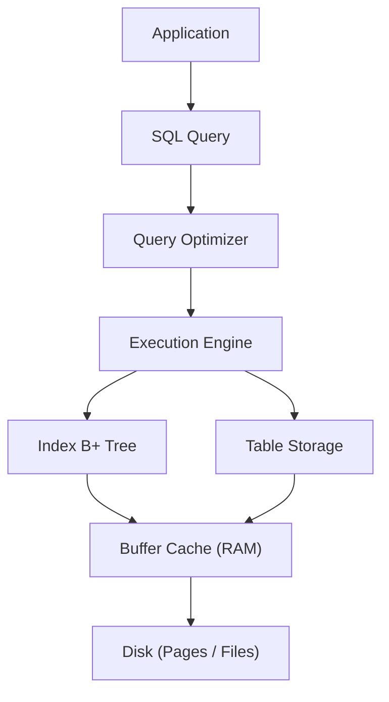
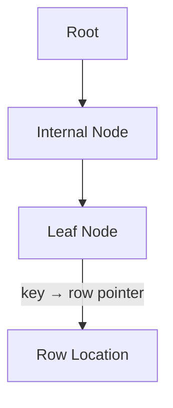
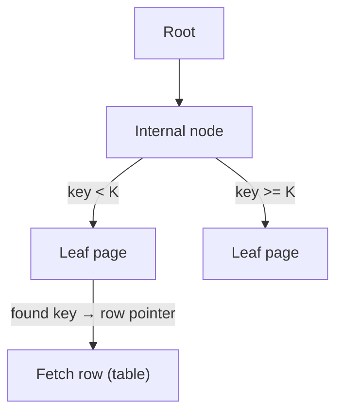
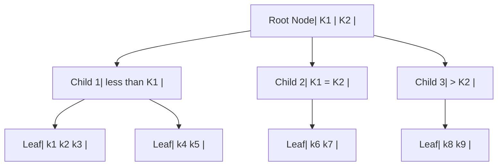

# Storage and Retrival

## BitCask: A key value store

- A log-structured key-value storage engine designed for fast writes and simple reads
- The map will be having the key against the position of the key in the 2d array(basically, starting point of the key).
- Kind of append only type of data structure
- In-memory hash table.

Actions performed:

- All writes are append-only to disk
- Keeps an in-memory hash map (key → file offset)
- Reads are:
  - Look up key in memory
  - Jump directly to disk location

- Search
- Update
- Compaction
- Delete

Pain points:

- Need to more segemts as it scales. Need to introduce compaction.

Pros and Cons:

- fast read and write because (sequential write and offset to read)
- No complex data structure to maintain on disk (append-only)

Cons:

- Less scalable.

Example:

-

## SSTable: Sorted String Table

- Sorted by key
- Immutable (read-only after write)
- Stored on disk
- Supports efficient sequential and range reads
- Used in LSM Trees (Log-Structured Merge-Tree)
  - Writes go to memory (memtable)
  - Then flushed to disk as SSTables
  - Later merged/compacted
- Tree structure , In-memory writer
- Implemented by Red-Black Tree | Balanced Binary Tree.
- Faster because of the skip list.
- Memtable in Inmemory Table and flush it to SSD/HDD.
- Garbage collector with compaction on SSD/HDD.
- If multiple sgments exists , uses external sorting to merge them. (Merge Tree + Merge sorting)
- MemTable + Logging + copies to SSD/HDD.
  - Log using Write Ahead Logging (WAL)

### Internal Structure of SSTable

- Data blocks → actual key-value pairs (sorted)
- Index block → helps locate keys quickly
- Bloom filter → avoids unnecessary disk reads
- Metadata → stats, compression info



### Write Path


### Read Path

Search order:

- MemTable
- Newer SSTables
- Older SSTables


### Compaction

Since SSTables are immutable:

- New writes create new SSTables
- Old data becomes stale
- System runs compaction:

### Trade-offs

- Read amplification (check multiple SSTables)
- Compaction overhead
- Storage amplification

### SSTables directly impact

- Latency → read amplification
- Failure handling → WAL + immutable files = durability
- Regional systems → used in distributed DBs (Cassandra)
- Caching → Bloom filters reduce unnecessary reads

## LSM Tree: Log-Structured Merge Tree

- Combination of SSTables and MemTables (No inplace update)
- LSM = Memtable + SStable + WAL + compaction
- LSM Tree = “Write everything fast in memory, flush to disk in sorted chunks, and continuously merge to stay efficient.”
- It is not implemeneted a B-Tree, rather ain tree structure

In-memory Updates::

Typically implemented as:

- Skip list (most common)
- Balanced tree (sometimes)

LSM Approach:

``` text
Write → MemTable → SSTable → Compaction → Merged SSTables
```

B-Tree Approach:

```text
Write → Find node → Modify node → Rebalance tree
```

Why LSM avoids B-Trees

- Problem with B-Trees
- Random disk I/O (slow on SSD/HDD for writes)
- Frequent node splits

LSM solution

- Sequential writes only
- Batch compaction later

### Flow diagram



- what happens when you write to a database that uses LSM trees:
  - Memtable (Memory Component): New writes go into an in-memory structure called a memtable, typically implemented as a sorted data structure like a red-black tree or skip list. This is extremely fast since it's all in RAM.
  - Write-Ahead Log (WAL): To ensure durability, every write is also appended to a write-ahead log on disk. This is a sequential append operation, which is much faster than random writes.
  - Flush to SSTable: Once the memtable reaches a certain size (often a few megabytes), it's frozen and flushed to disk as an immutable Sorted String Table (SSTable). This is a single sequential write operation that can write megabytes of data at once.
  - Compaction: Over time, you accumulate many SSTables on disk. A background process called compaction periodically merges these files, removing duplicates and deleted entries. This keeps the number of files manageable and maintains read performance.

- When you query for a specific key, the database must check multiple places:
  - First, the memtable: Is the data in the current in-memory buffer?
  - Then, immutable memtables: Any memtables waiting to be flushed?
  - Finally, all SSTables on disk: Starting from the newest (most likely to have recent data) and working backwards

- LSM trees typically employ several optimizations:
  - Bloom Filters: Each SSTable has an associated bloom filter - a probabilistic data structure that can quickly tell you if a key is definitely NOT in that file. This lets you skip most SSTables without reading them. If the bloom filter says "maybe", you still need to check, but it eliminates the definite misses.
  - Sparse Indexes: Since SSTables are sorted, they maintain sparse indexes that tell you the range of keys in each block. If you're looking for user_id=500 and an SSTable only contains keys 1000-2000, you can skip it entirely.
  - Compaction Strategies: Different compaction strategies optimize for different workloads. Size-tiered compaction minimizes write amplification but can lead to more files to check. Leveled compaction maintains fewer files but requires more frequent rewrites.

- Write path
  - Write → WAL (durability)
  - Write → MemTable (RAM)
  - MemTable → flushed to Level 0 SSTables
- Storage layout
  - Levels: L0 → L1 → LN
  - Each level has:
    - SSTables
    - Index blocks
- Compaction
  - L0 → L1 → LN (progressive merge)
- Read path
  - Read → MemTable (fastest)
  - Read → Bloom Filter (avoid unnecessary disk hits)
  - Then → SSTables (newer to older)

## Bloom Filter

- O(1) lookup and datastructure
- Reduce False positives
- Logic: If key present - Probablistic, if key not present - Deterministic
- Used in
  - malicous site identification
  - Unique username

### How it works

- 2 hashes and big Array to identify the bool probablity
- Hashes increases accuracy more hases increase computation
- Array Filter

Links:

- [Bloom filter visualization](https://hur.st/bloomfilter/)

## Merkle Tree

- Consists of leaves, internal nodes, root node
- Root = single has representing data
- Leaf = hash of data block
- Internal node = hash of child nodes
- Any byte changes root of hash changes
- Merkle Tree = a hierarchical checksum that lets you verify any piece of data with only O(log n) information.

Why it used:

- Efficient integrity verification
  - To prove D3 is part of the dataset, you don’t need all data—only a Merkle proof.
- Tamper detection
  - Change in any leaf propagates up → root mismatch
- Bandwidth savings
  - Only send:
    - Hash of the target data block
    - Hash of a small set of sibling hashes



- Split data into chunks: D1, D2, D3, D4
- Hash each:
  - 1 = H(D1), H2 = H(D2), ...
- Pair and hash again:
  - H12 = H(H1 || H2), H34 = H(H3 || H4)
- Continue until one value remains → Merkle Root

### Where it’s used

- Blockchains (e.g., Bitcoin)
- Transactions in a block → Merkle root stored in block header
- Distributed systems / P2P sync
- Efficiently detect differences between replicas
- Git-like systems
- Content-addressable storage (tree of hashes)
- CDNs / storage systems
- Data integrity and deduplication

## Mental Model of Database



### Layer of the Database

- Application Layer

Sends the SQL query:

```text
SELECT * FROM users WHERE user_id = 1
```

- Query Optimizer Layer

Decide:

- Use index
- Full Table scan

- Execution Engine Layer

  - Actually runs the plan
  - Calls:
    - Index Lookup
    - Table Tech

- Index Layer (B+ Tree)



- Fast lookup
- Leaf gives

```text
key → primary key OR row pointer
```

- Table Storage

  Two models:
  - Heap (PostgreSQL style)
    Rows stored unordered
    Index → points to row location
  - Clustered (InnoDB style)
    Table itself is a B+ Tree
    Leaf = actual row data

- Buffer Layer

  - RAM layer between DB and disk
  - Stores frequently used pages

- Disk Layer
Data stored as pages (4KB–16KB)
  Includes:
  - Table pages
  - Index pages
  - WAL logs

### Data in B-Tree

- Data pointer
- Record pointer
- Key

Data Lookup:



Steps:

- Binary search within node (in-memory after page read)
- Follow pointer to next node
- Repeat until leaf → get row pointer (or the row itself if it’s a clustered index)
- Cost: O(log_b N) page reads (b = fan-out, often 100+)

## Database Indexing

- Single or Multi-level indexing
  - Single use primary keys or secondary keys or by clustering
  - Multi-level index: Composite index (user_id + timestamp)
- Multi-level indexing for faster searching uses B-Tree or B+Tree
Why B-Tree?

- High fan-out ⇒ very low height ⇒ few I/Os
- Sorted order ⇒ efficient range queries (BETWEEN, ORDER BY)
- Page locality ⇒ good cache behavior

Why B+Tree?

- B+-Tree optimizes both point lookups and range scans with minimal disk I/O and excellent locality.
  
### Comparison B-Tree vs B+-Tree

| Feature           | B-Tree              | B+-Tree        |
|------------------|--------------------|---------------|
| Data location    | Internal + leaf    | Leaf only     |
| Range scan       | Poor               | Excellent     |
| Tree height      | Higher             | Lower         |
| Disk I/O         | More               | Less          |
| Sequential access| Weak               | Strong        |
| DB usage         | Rare               | Standard      |

Examples:

- MySQL InnoDB → clustered B+-Tree
- PostgreSQL → B+-Tree indexes
- SQLite → B+-Tree

### B Tree



- Every node in a B-tree follows strict rules:
- All leaf nodes must be at the same depth
- Each node can contain between m/2 and m keys (where m is the order of the tree)
- A node with k keys must have exactly k+1 children
- Keys within a node are kept in sorted order

Why B-Tree

- They maintain sorted order, making range queries and ORDER BY operations efficient
- They're self-balancing, ensuring predictable performance even as data grows
- They minimize disk I/O by matching their structure to how databases store data
- They handle both equality searches (email = 'x') and range searches (age > 25) equally well
- They remain balanced even with random inserts and deletes, avoiding the performance cliffs you might see with simpler tree structures

Examples:

- PostgreSQL automatically creates two B-tree indexes: one for the primary key and one for the unique email constraint. These B-trees maintain sorted order, which is crucial for both uniqueness checks and range queries.
- DynamoDB organizes items within a partition in sort-key order, enabling efficient range queries within that partition. Its storage internals aren’t publicly documented in detail, but it’s widely understood to use an LSM-style storage architecture rather than a B-tree for its underlying engine.
- Even MongoDB, with its document model, uses B-trees (specifically B+ trees, a variant where all data is stored in leaf nodes) for its indexes.