# Transaction and Concurrency

## Transactions

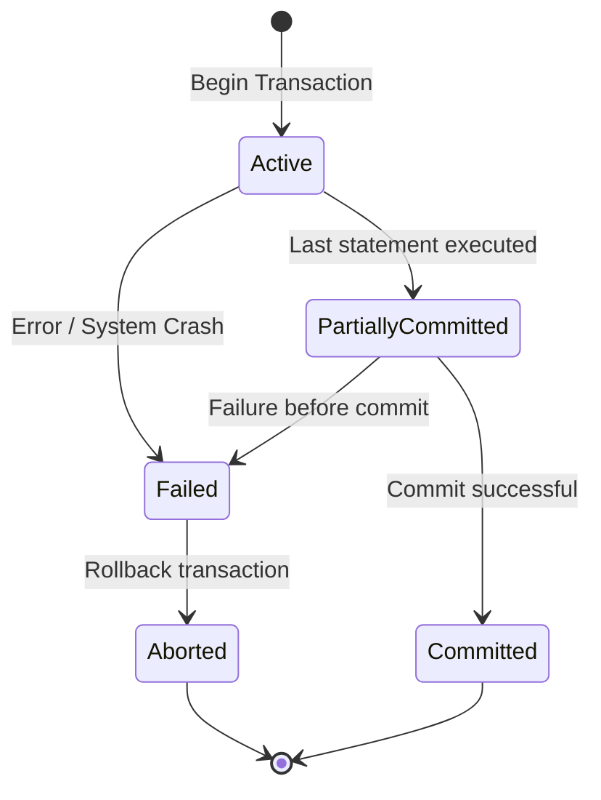
```mermaid
stateDiagram-v2
    [*] --> Active : Begin Transaction

    Active --> PartiallyCommitted : Last statement executed
    Active --> Failed : Error / System Crash

    PartiallyCommitted --> Committed : Commit successful
    PartiallyCommitted --> Failed : Failure before commit

    Failed --> Aborted : Rollback transaction

    Aborted --> [*]
    Committed --> [*]
```

## Concurrency

### Lost update problem (Write - write conflict):

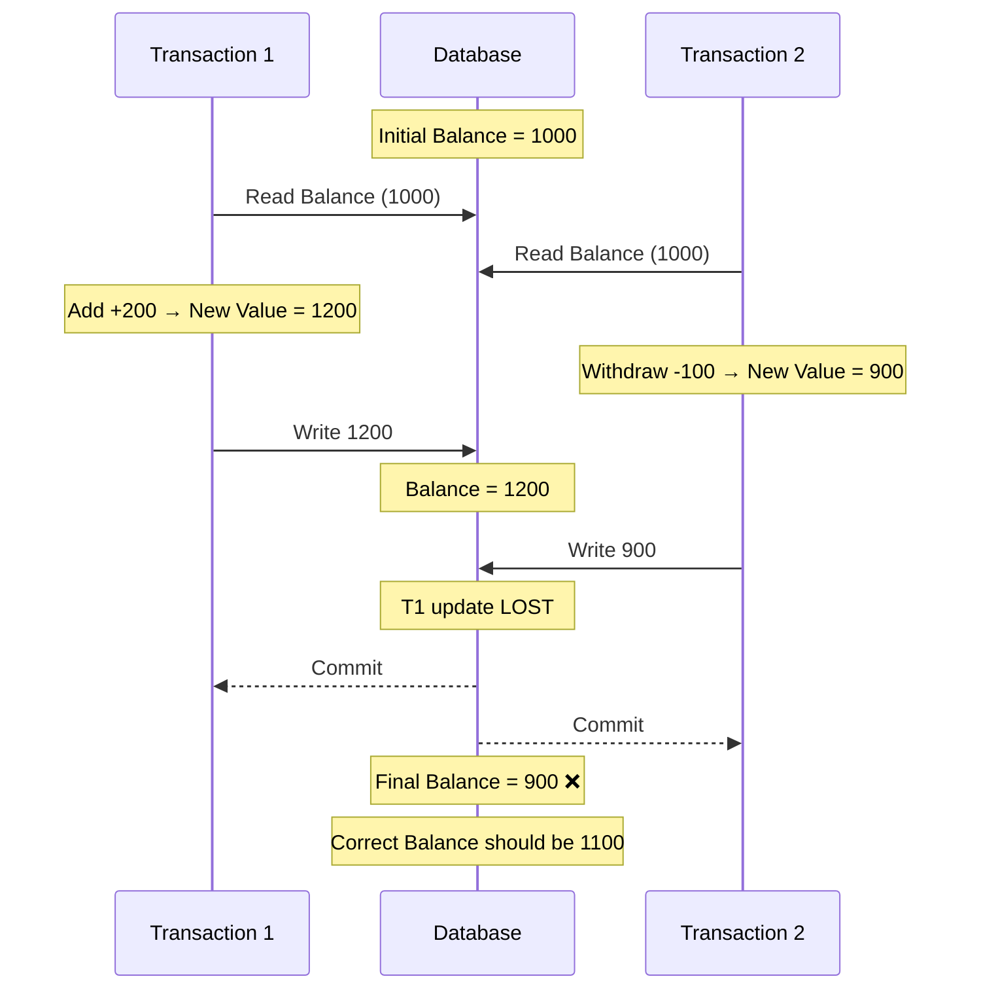
```mermaid
sequenceDiagram
    participant T1 as Transaction 1
    participant DB as Database
    participant T2 as Transaction 2

    Note over DB: Initial Balance = 1000

    T1->>DB: Read Balance (1000)
    T2->>DB: Read Balance (1000)

    Note over T1: Add +200 → New Value = 1200
    Note over T2: Withdraw -100 → New Value = 900

    T1->>DB: Write 1200
    Note over DB: Balance = 1200

    T2->>DB: Write 900
    Note over DB: T1 update LOST

    DB-->>T1: Commit
    DB-->>T2: Commit

    Note over DB: Final Balance = 900 ❌
    Note over DB: Correct Balance should be 1100
```

The problem occurs because:

- Two transactions read the same data simultaneously.
- Both transactions modify data independently.
- One transaction overwrites the other's update.
- No concurrency control mechanism prevents the overwrite.

#### Solution using pessimistic locking:

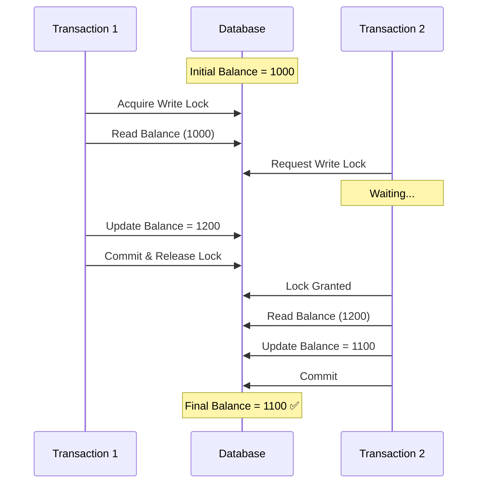
```mermaid
sequenceDiagram
    participant T1 as Transaction 1
    participant DB as Database
    participant T2 as Transaction 2

    Note over DB: Initial Balance = 1000

    T1->>DB: Acquire Write Lock
    T1->>DB: Read Balance (1000)

    T2->>DB: Request Write Lock
    Note over T2: Waiting...

    T1->>DB: Update Balance = 1200
    T1->>DB: Commit & Release Lock

    T2->>DB: Lock Granted
    T2->>DB: Read Balance (1200)
    T2->>DB: Update Balance = 1100
    T2->>DB: Commit

    Note over DB: Final Balance = 1100 ✅
```

#### Solution using optimistic locking + Version control:

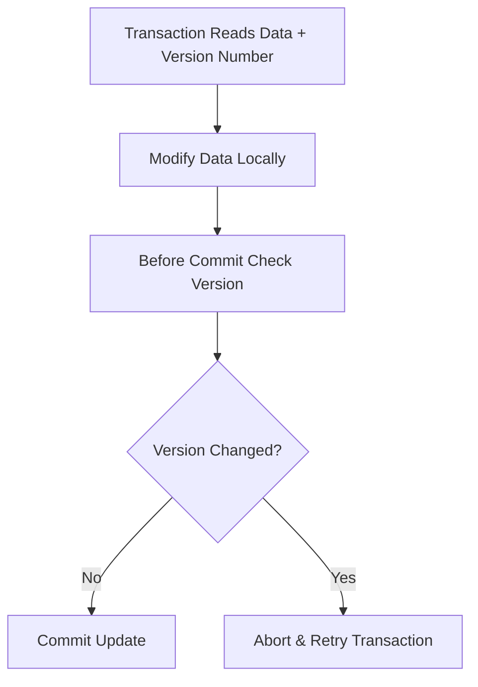
```mermaid
flowchart TD
    A[Transaction Reads Data + Version Number]
    B[Modify Data Locally]
    C[Before Commit Check Version]
    D{Version Changed?}

    D -- No --> E[Commit Update]
    D -- Yes --> F[Abort & Retry Transaction]

    A --> B --> C --> D
```

### Dirty read problem (Write - read conflict):

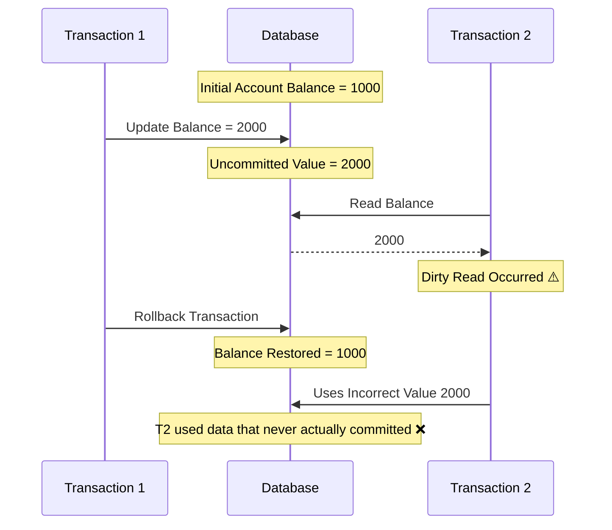
```mermaid
sequenceDiagram
    participant T1 as Transaction 1
    participant DB as Database
    participant T2 as Transaction 2

    Note over DB: Initial Account Balance = 1000

    T1->>DB: Update Balance = 2000
    Note over DB: Uncommitted Value = 2000

    T2->>DB: Read Balance
    DB-->>T2: 2000

    Note over T2: Dirty Read Occurred ⚠️

    T1->>DB: Rollback Transaction
    Note over DB: Balance Restored = 1000

    T2->>DB: Uses Incorrect Value 2000

    Note over DB: T2 used data that never actually committed ❌
```

Solution for dirty read:

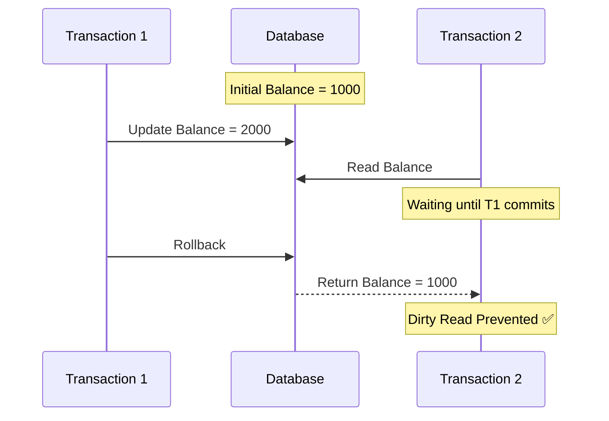
```mermaid
sequenceDiagram
    participant T1 as Transaction 1
    participant DB as Database
    participant T2 as Transaction 2

    Note over DB: Initial Balance = 1000

    T1->>DB: Update Balance = 2000

    T2->>DB: Read Balance
    Note over T2: Waiting until T1 commits

    T1->>DB: Rollback

    DB-->>T2: Return Balance = 1000

    Note over T2: Dirty Read Prevented ✅
```

### Non-repeatable read problem (Read - write conflict):

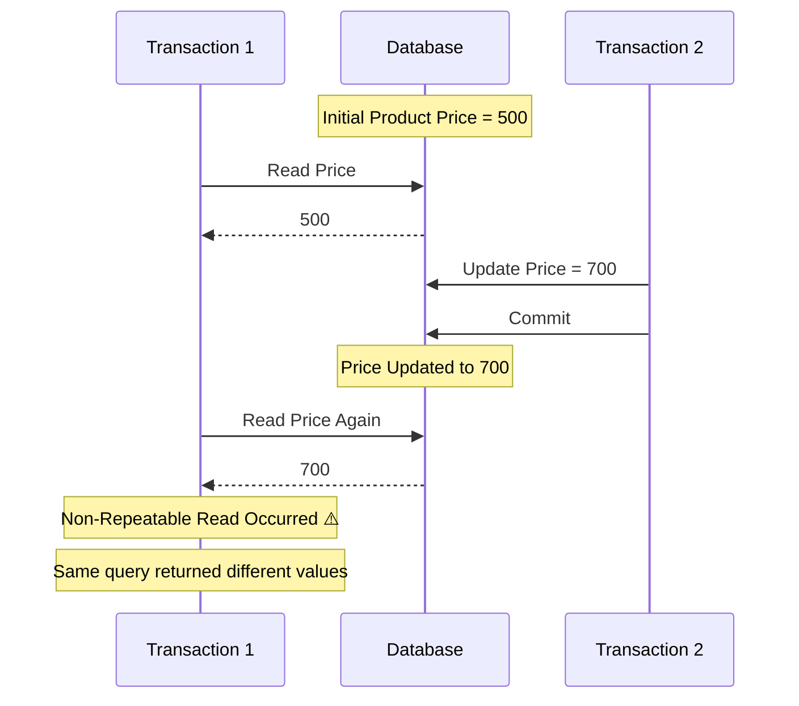
```mermaid
sequenceDiagram
    participant T1 as Transaction 1
    participant DB as Database
    participant T2 as Transaction 2

    Note over DB: Initial Product Price = 500

    T1->>DB: Read Price
    DB-->>T1: 500

    T2->>DB: Update Price = 700
    T2->>DB: Commit

    Note over DB: Price Updated to 700

    T1->>DB: Read Price Again
    DB-->>T1: 700

    Note over T1: Non-Repeatable Read Occurred ⚠️
    Note over T1: Same query returned different values
```

Solution for non-repeatable read:

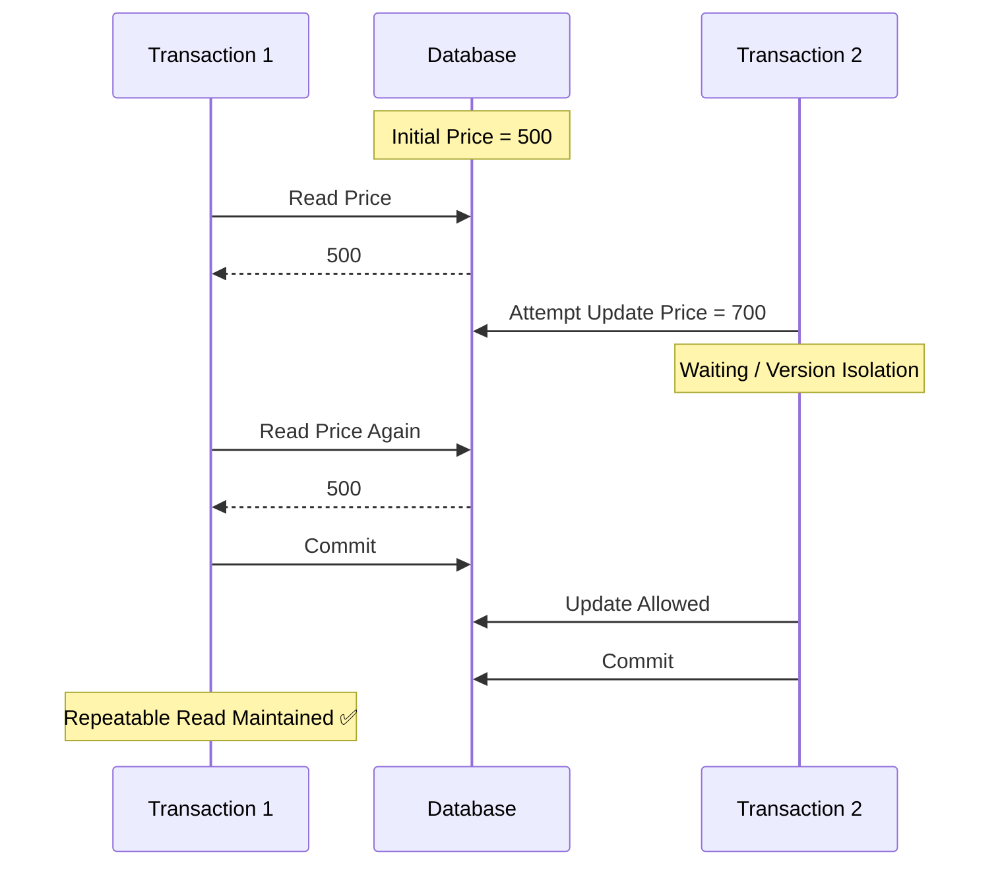
```mermaid
sequenceDiagram
    participant T1 as Transaction 1
    participant DB as Database
    participant T2 as Transaction 2

    Note over DB: Initial Price = 500

    T1->>DB: Read Price
    DB-->>T1: 500

    T2->>DB: Attempt Update Price = 700
    Note over T2: Waiting / Version Isolation

    T1->>DB: Read Price Again
    DB-->>T1: 500

    T1->>DB: Commit

    T2->>DB: Update Allowed
    T2->>DB: Commit

    Note over T1: Repeatable Read Maintained ✅
```

### Phantom read problem (Read - read conflict):

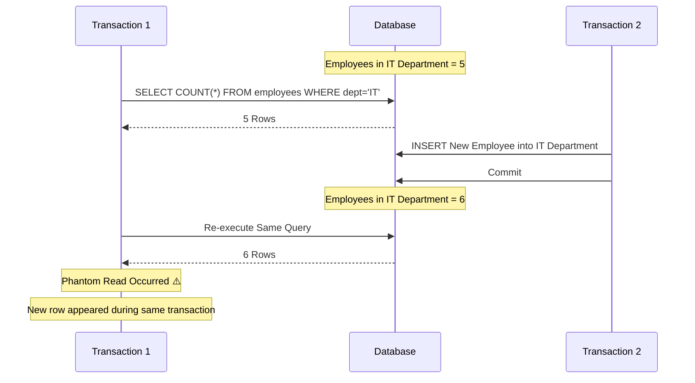
```mermaid
sequenceDiagram
    participant T1 as Transaction 1
    participant DB as Database
    participant T2 as Transaction 2

    Note over DB: Employees in IT Department = 5

    T1->>DB: SELECT COUNT(*) FROM employees WHERE dept='IT'
    DB-->>T1: 5 Rows

    T2->>DB: INSERT New Employee into IT Department
    T2->>DB: Commit

    Note over DB: Employees in IT Department = 6

    T1->>DB: Re-execute Same Query
    DB-->>T1: 6 Rows

    Note over T1: Phantom Read Occurred ⚠️
    Note over T1: New row appeared during same transaction
```

Solution for phantom read:
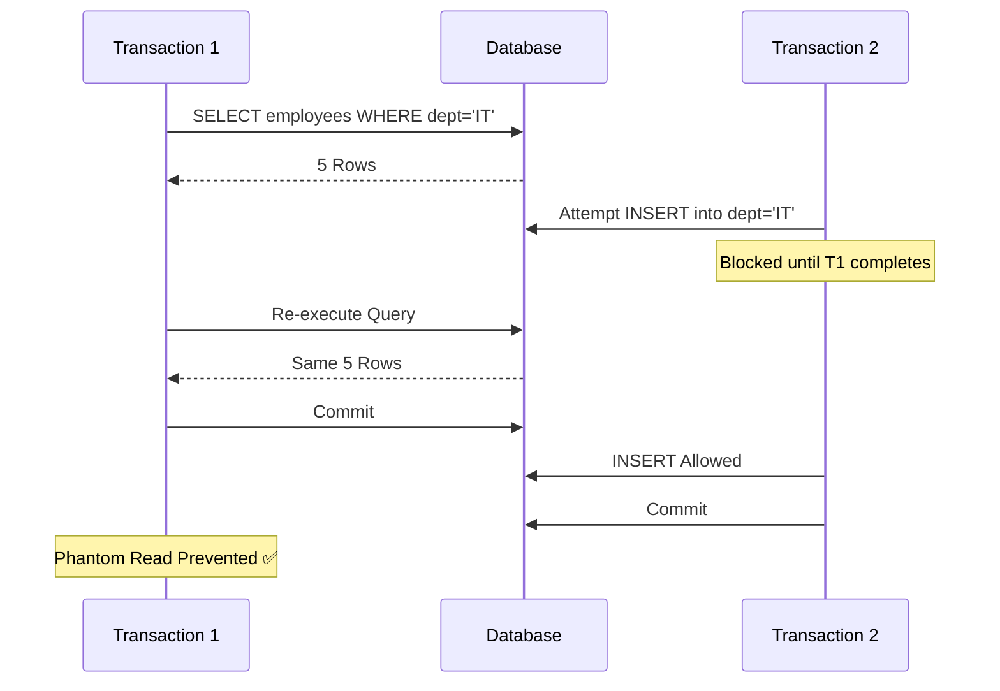
```mermaid
sequenceDiagram
    participant T1 as Transaction 1
    participant DB as Database
    participant T2 as Transaction 2

    T1->>DB: SELECT employees WHERE dept='IT'
    DB-->>T1: 5 Rows

    T2->>DB: Attempt INSERT into dept='IT'
    Note over T2: Blocked until T1 completes

    T1->>DB: Re-execute Query
    DB-->>T1: Same 5 Rows

    T1->>DB: Commit

    T2->>DB: INSERT Allowed
    T2->>DB: Commit

    Note over T1: Phantom Read Prevented ✅
```

*Note*: Phantom read (delete or insert row) and non-repeatable read(update or delete row value) are the same problem but differ in where it updates.

- Query only give one employee
- Change value of thomas age: Age will be diffferent in two read. (Non-repeatable read)
- Query giving more rows than expected Earlier it was thomas but in second query it will be more rows (Tjhomas and sam).(Phantom read)

### Incorrect summary problem:

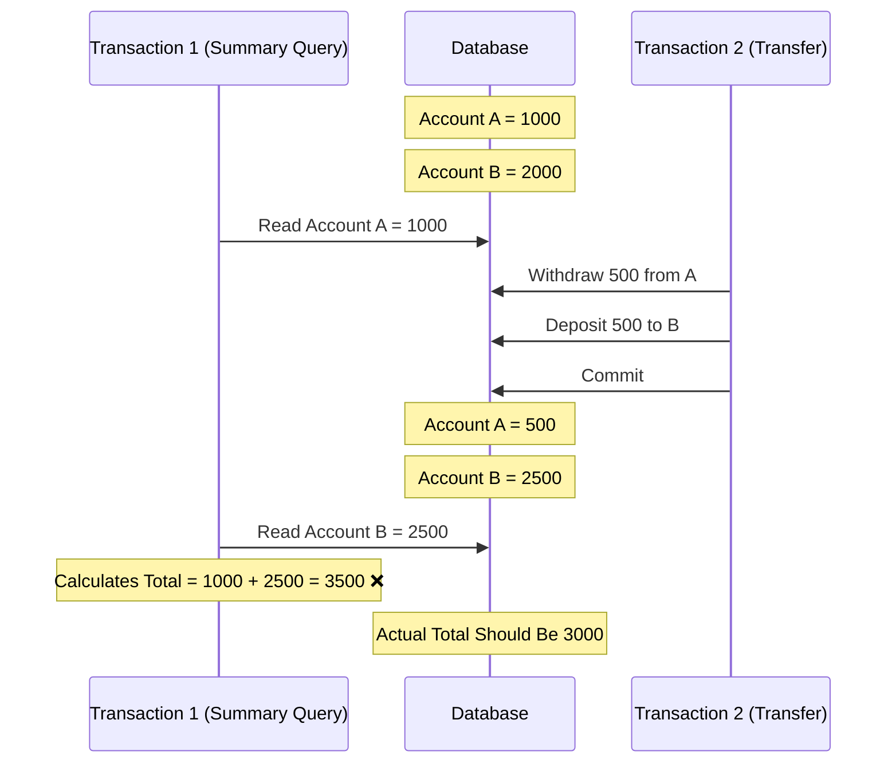
```mermaid
sequenceDiagram
    participant T1 as Transaction 1 (Summary Query)
    participant DB as Database
    participant T2 as Transaction 2 (Transfer)

    Note over DB: Account A = 1000
    Note over DB: Account B = 2000

    T1->>DB: Read Account A = 1000

    T2->>DB: Withdraw 500 from A
    T2->>DB: Deposit 500 to B
    T2->>DB: Commit

    Note over DB: Account A = 500
    Note over DB: Account B = 2500

    T1->>DB: Read Account B = 2500

    Note over T1: Calculates Total = 1000 + 2500 = 3500 ❌
    Note over DB: Actual Total Should Be 3000
```

Solution for incorrect summary problem:

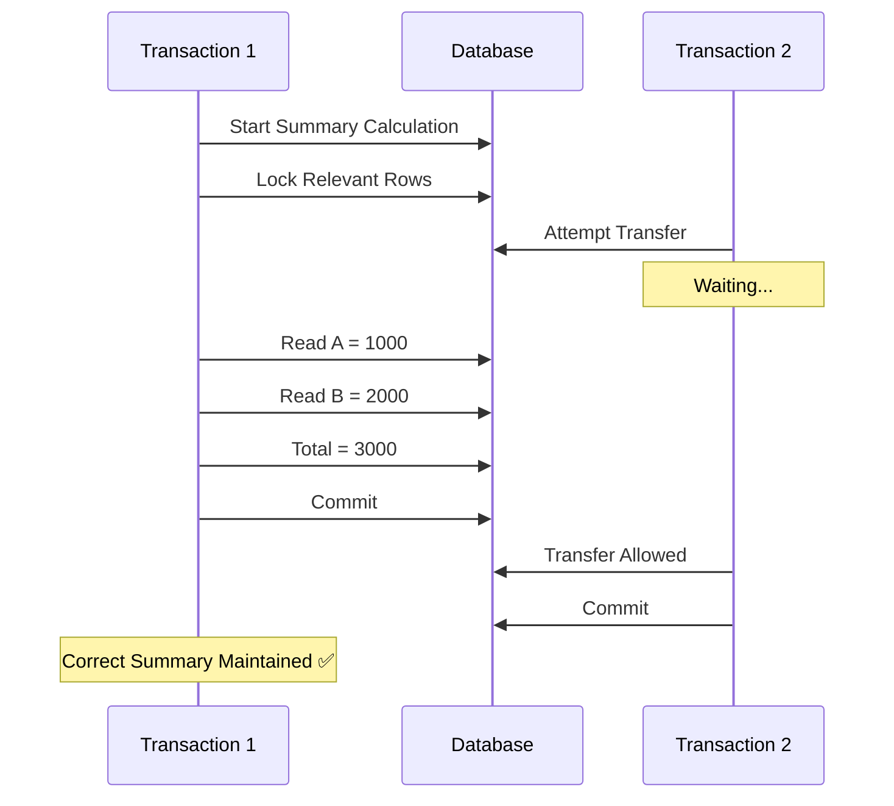
```mermaid
sequenceDiagram
    participant T1 as Transaction 1
    participant DB as Database
    participant T2 as Transaction 2

    T1->>DB: Start Summary Calculation
    T1->>DB: Lock Relevant Rows

    T2->>DB: Attempt Transfer
    Note over T2: Waiting...

    T1->>DB: Read A = 1000
    T1->>DB: Read B = 2000
    T1->>DB: Total = 3000
    T1->>DB: Commit

    T2->>DB: Transfer Allowed
    T2->>DB: Commit

    Note over T1: Correct Summary Maintained ✅
```

#### Comparision between types of isolations:

| Isolation Level  | Dirty Read   | Non-Repeatable Read   | Phantom Read |
| ---------------- | -----------  | -------------------   | ------------ |
| Read Uncommitted | ✅ Possible  | ✅ Possible           | ✅ Possible   |
| Read Committed   | ❌ Prevented | ✅ Possible          | ✅ Possible   |
| Repeatable Read  | ❌ Prevented | ❌ Prevented         | ✅ Possible*  |
| Serializable     | ❌ Prevented | ❌ Prevented         | ❌ Prevented  |

## Serialization:

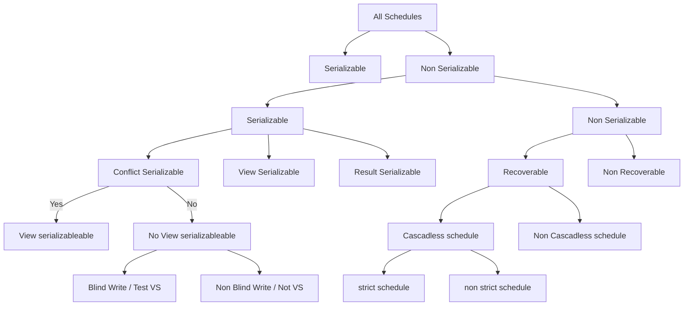
```mermaid
flowchart TD

    A[All Schedules]

    A --> B[Serializable]
    A --> C[Non Serializable]

    C --> D[Serializable]
    C --> E[Non Serializable]

    D --> F[Conflict Serializable]
    D --> G[View Serializable]
    D --> H[Result Serializable]

    E --> I[Recoverable]
    E --> J[Non Recoverable]

    I --> K[Cascadless schedule]
    I --> L[Non Cascadless schedule]

    K --> M[strict schedule]
    K --> N[non strict schedule]

    F -- Yes --> O[View serializableable]
    F -- No --> P[No View serializableable]

    P --> Q[Blind Write / Test VS]
    P --> R[Non Blind Write / Not VS]
```

``` text
Super set: Result Serializable
    Sub set: View Serializable
    Sub set: Conflict Serializable
```

Use case for conflict serializable:

- Stock trading
- Payment processing
- DB concurrency
- Ecommerce inventory management
- Ticket reservation system

## Concurency Control

- Shared Locks
- Exclusive Locks

Issues:

- Deadlocks
- Starvation

| Protocol         | Conflict Serializable | Cascading Rollback Possible | Deadlock Possible | Recoverable   | Strict     |
| ---------------- | --------------------- | --------------------------- | ----------------- | ------------- | ---------- |
| Basic 2PL        | ✅ Yes                 | ✅ Yes                       | ✅ Yes             | ⚠️ Not Always | ❌ No       |
| Strict 2PL       | ✅ Yes                 | ❌ No                        | ✅ Yes             | ✅ Yes         | ✅ Yes      |
| Rigorous 2PL     | ✅ Yes                 | ❌ No                        | ✅ Yes             | ✅ Yes         | ✅ Stronger |
| Conservative 2PL | ✅ Yes                 | Depends                     | ❌ No              | Depends       | Depends    |

### 2 Phase Locking

Growing Phase:
    Only acquire locks

Shrinking Phase:
    Only release locks

| Property          | Status     |
| ----------------- | ---------- |
| Serializable      | ✅ Yes      |
| Cascading Failure | ✅ Possible |
| Deadlock          | ✅ Possible |

T1 writes A
T1 unlocks A
T2 reads A
T1 aborts
→ T2 must rollback

#### Strict 2 Phase Locking

All WRITE locks held until COMMIT/ABORT
| Property          | Status      |
| ----------------- | ----------- |
| Serializable      | ✅ Yes       |
| Cascading Failure | ❌ Prevented |
| Deadlock          | ✅ Possible  |

#### Rigourous 2 Phase Locking:

ALL locks (Read + Write)
held until COMMIT

| Feature                      | Strict 2PL | Rigorous 2PL |
| ---------------------------- | ---------- | ------------ |
| Write locks held till commit | ✅          | ✅            |
| Read locks held till commit  | ❌          | ✅            |


#### Conservative 2 Phase Locking

Transaction acquires ALL required locks before starting

| Property     | Status      |
| ------------ | ----------- |
| Serializable | ✅ Yes       |
| Deadlock     | ❌ Prevented |

- Why No Deadlock?
  - Because transaction never holds partial resources while waiting.
  - No circular wait condition.

#### Use cases:

| Database Style               | Common Protocol  |
| ---------------------------- | ---------------- |
| Traditional RDBMS            | Strict 2PL       |
| High Safety Systems          | Rigorous 2PL     |
| Distributed Planning Systems | Conservative 2PL |
| Academic Foundation          | Basic 2PL        |

### Flow Graph based Locking (FGL)

- Tree based locking which is generalized to get Graph based locking (FGL)
  - Database

├── Table
│    ├── Page
│    │    ├── Row

or 

 A
├── B
│   ├── D
│   └── E
└── C

Rules:

- First lock can be any node
- To lock a node, Transaction must already hold lock on parent node
- Unlocking allowed anytime
- Cannot relock a node that node again

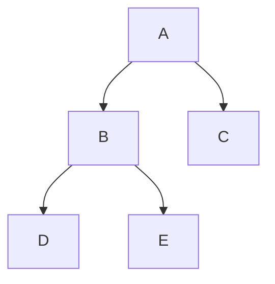
```mermaid
flowchart TD
    A[A]
    B[B]
    C[C]
    D[D]
    E[E]

    A --> B
    A --> C
    B --> D
    B --> E
```

This use case is valid

Lock(A)
Lock(B)
Lock(D)
Unlock(D)
Lock(E)

but this is not valid

Lock(D) because parent B node is not locked

*Note:* Since Tree based is hierarchical,   Top → Bottom it can avoid deadlocks

Graph based locking:

This uses dependency/precedence graphs.  Transactions represented as nodes.  Conflicts represented as edges.

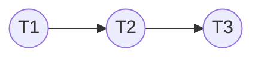
```mermaid
flowchart LR

    T1((T1)) --> T2((T2))
    T2((T2)) --> T3((T3))
```

This works

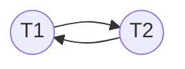
```mermaid
flowchart LR

    T1((T1)) --> T2((T2))
    T2((T2)) --> T1((T1))
```

This wont work

Before allowing operation check below:
    System checks whether dependency graph
    would become cyclic

if cyclic then abort
If not cyclic, then proceed

### Timestamp based Locking (TBL)

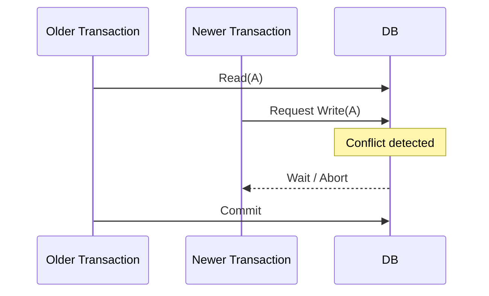
```mermaid
sequenceDiagram
    participant T1 as Older Transaction
    participant T2 as Newer Transaction
    participant DB

    T1->>DB: Read(A)

    T2->>DB: Request Write(A)

    Note over DB: Conflict detected

    DB-->>T2: Wait / Abort

    T1->>DB: Commit
```

Avoid:

deadlocks
cyclic waiting

by enforcing temporal ordering.

| Algorithm  | Rule                        |
| ---------- | --------------------------- |
| Wait-Die   | Older waits, younger aborts |
| Wound-Wait | Older preempts younger      |

| Feature           | Time-Based Locking | Flow Graph Locking          |
| ----------------- | ------------------ | --------------------------- |
| Main Idea         | Time ordering      | Dependency graph            |
| Uses              | Timestamps         | Serialization graph         |
| Deadlock          | Prevented          | Avoided via cycle detection |
| Serializable      | Yes                | Yes                         |
| Complexity        | Medium             | Higher                      |
| Conflict Handling | Timestamp rules    | Graph analysis              |


### MVCC (Multi Version Concurrency Control)
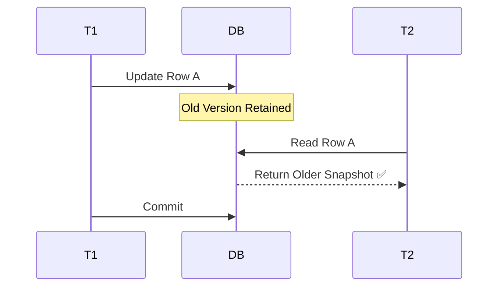
```mermaid
sequenceDiagram
    participant T1
    participant DB
    participant T2

    T1->>DB: Update Row A

    Note over DB: Old Version Retained

    T2->>DB: Read Row A
    DB-->>T2: Return Older Snapshot ✅

    T1->>DB: Commit
```

Internal of MVCC

| Field   | Meaning                              |
| ------- | ------------------------------------ |
| xmin    | Transaction that created row         |
| xmax    | Transaction that deleted/updated row |
| version | Row version                          |

Example

| Version | Value       | Created By | Deleted By |
| ------- | ----------- | ---------- | ---------- |
| V1      | Salary=5000 | T1         | T2         |
| V2      | Salary=7000 | T2         | NULL       |

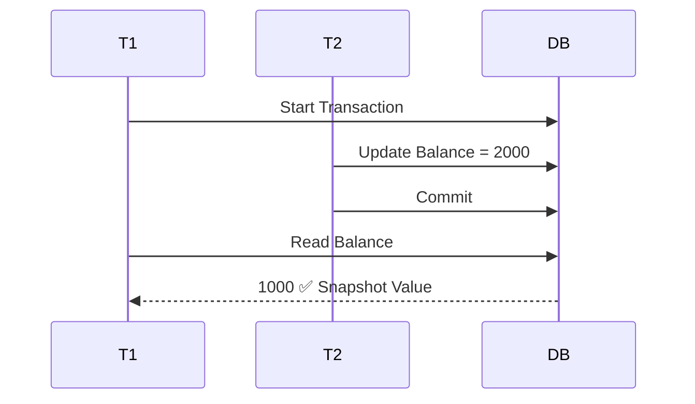
```mermaid
sequenceDiagram
    participant T1
    participant T2
    participant DB

    T1->>DB: Start Transaction

    T2->>DB: Update Balance = 2000
    T2->>DB: Commit

    T1->>DB: Read Balance
    DB-->>T1: 1000 ✅ Snapshot Value
```

Even though T2 committed:

T1 still sees older snapshot.

| Problem                | Prevented?                 |
| ---------------------- | -------------------------- |
| Dirty Reads            | ✅ Yes                      |
| Read Locks             | Mostly avoided             |
| Reader-Writer Blocking | ✅ Yes                      |
| Non-Repeatable Reads   | ✅ Under snapshot isolation |
| Some Phantom Reads     | ✅ Often                    |


### Serialzable snapshot isolation

- Optimized Concurrency Control + MVCC

Performance close to Snapshot Isolation
+
Correctness close to Serializable isolation

Normal MVCC allows write skew anomaly:

dirty reads
non-repeatable reads

BUT it still allows anomalies like:

Write Skew

which breaks true serializability.  SSI fixes this.

*Note:* Core idea of SSI is to Detect dangerous serialization patterns dynamically

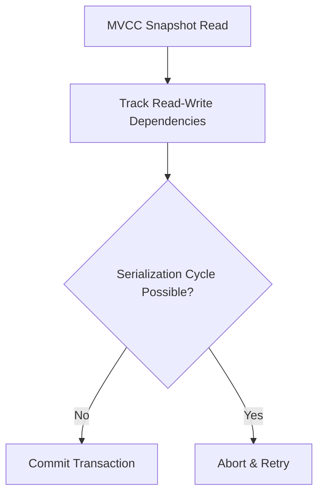
```mermaid
flowchart TD

    A[MVCC Snapshot Read]

    B[Track Read-Write Dependencies]

    C{Serialization Cycle Possible?}

    C -- No --> D[Commit Transaction]

    C -- Yes --> E[Abort & Retry]

    A --> B --> C
```

#### How PostgreSQL Implements SSI

PostgreSQL uses:

Serializable Snapshot Isolation

instead of traditional lock-heavy serializable isolation.

Internally PostgreSQL:

- tracks rw-dependencies
- uses predicate locks
- monitors dangerous structures
- aborts conflicting transactions.

```mermaid
sequenceDiagram
    participant T1
    participant T2
    participant DB

    T1->>DB: Query balance > 1000

    T2->>DB: Insert row balance=2000

    Note over DB: Predicate dependency tracked

    T2->>DB: Commit

    T1->>DB: Commit Attempt

    DB-->>T1: Abort due to serialization conflict
```

This is how it works:

```mermaid
flowchart TD

    A[MVCC Snapshot Read]

    B[Track Read-Write Dependencies]

    C{Serialization Cycle Possible?}

    C -- No --> D[Commit Transaction]

    C -- Yes --> E[Abort & Retry]

    A --> B --> C
```